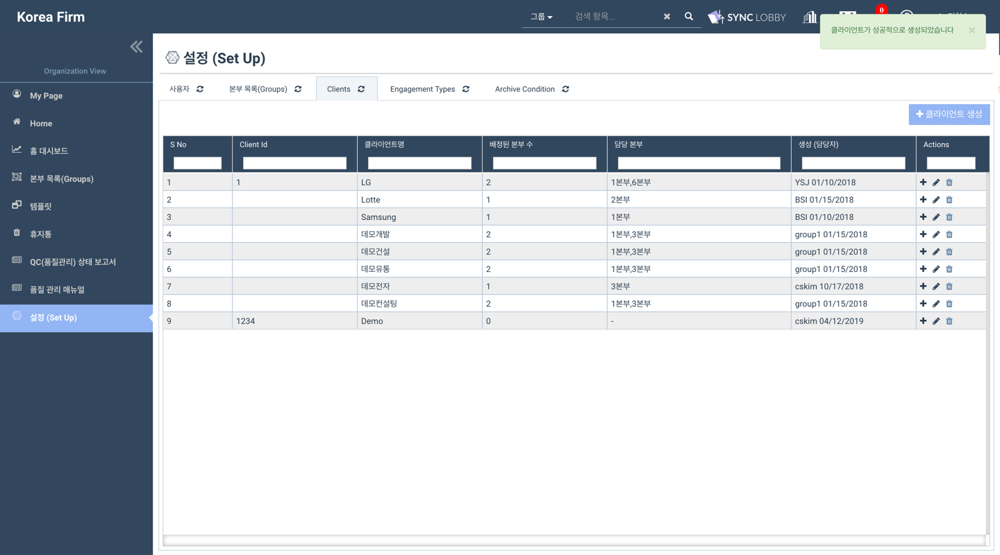

# \(ENG\)3. 클라이언트\(고객사\) 등록/수정/삭제하기

## 법인용 메뉴 \(Organization View\) 에서 클라이언트\(고객사\) 등록/수정/삭제 하기

## 요약보기

### 1. 클라이언트를 생성합니다.

1. 법인용 화면의 왼쪽 메뉴 목록에서 '설정\(Set Up\)'을 선택합니다.
2. '설정\(Set Up\)' 화면의 상단에서 '고객\(Client\)' 탭을 선택합니다.
3. 화면 우측 상단의 '클라이언트 생성' 버튼을 클릭합니다.
4. 클라이언트 이름과 아이디를 입력합니다. 
5. '생성' 버튼을 누릅니다. 
6. 화면 상단에 붉은색 로딩바가 나타나며 고객 생성이 진행됩니다. 로딩바가 다 채워질 때까지 잠시 기다려 주십시오.  

### 2. 클라이언트를 본부에 등록합니다.

1. 클라이언트\(고객사\)를 어딧로비에 생성해도, 등록된 클라이언트를 본부\(그룹\)에 추가하지 않으면 프로젝트 생성시 클라이언트가 나타나지 않습니다. 반드시 클라이언트를 적절한 본부에 배정하여 주십시오. 

## 상세보기

## 1. 클라이언트를 생성합니다.

1. 법인용 메뉴에서 설정\(setup\)을 선택합니다. 
2. 화면 위쪽 탭에서 Clients 를 선택합니다. 
3. 화면 오른쪽에서 클라이언트 생성 버튼을 누릅니다. 

1. 클라이언트 아이디를 입력합니다. 
2. 클라이언트 이름을 입력합니다. 

> 클라이언트 아이디는 법인 내부에서 정한 규칙을 따르시되, 없는 경우 임의로 작성하실 수 있습니다.

## 2. 클라이언트를 본부에 등록합니다.

프로젝트 생성 시 생성자가 소속된 본부에 속한 클라이언트만 목록에 나타납니다. 따라서 반드시 클라이언트를 적절한 본부에 배정해야 합니다.

1. 법인용 메뉴에서 설정\(Setup\)을 선택합니다. 
2. 본부 목록 탭을 선택합니다. 
3. 클라이언트를 등록할 본부를 선택한 후 오른쪽 끝의 + 모양 아이콘을 누릅니다. 

1. 위와 같은 창이 나타나면, 창의 상단에서 '본부에 클라이언트 지정'을 선택합니다. 

1. '클라이언트 목록' 아래 쪽의 검색창에 앞에서 생성한 클라이언트의 이름을 검색합니다. 
2. 검색결과에 나타난 클라이언트의 이름을 클릭하여 선택합니다.
3. 오른쪽 방향 화살표를 누릅니다.  

1. 클라이언트가 본부에 등록되면 화면 오른쪽 부분에 클라이언트 이름이 나타납니다. 
2. 화면 우측 상단에도 성공 메시지가 표시됩니다. 

## 3. 클라이언트 수정 / 삭제

등록한 클라이언트의 아이디와 이름을 수정하거나 클라이언트를 삭제할 수 있습니다.

1. 법인용 메뉴에서 설정\(Setup\) 을 선택합니다. 
2. 설정 화면의 상단 탭에서 Clients 를 선택합니다. 
3. 수정하려는 클라이언트의 오른쪽에서 연필 모양 버튼을 눌러 아이디와 이름을 수정합니다.  
4. 삭제하려는 클라이언트의 오른쪽에서 휴지통 모양 버튼을 눌러 클라이언트를 삭제합니다.  

