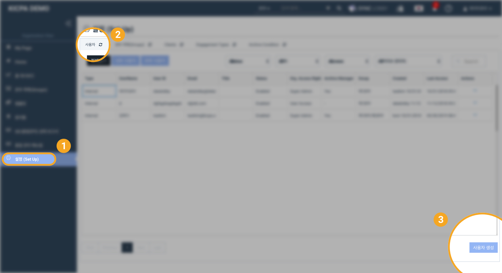
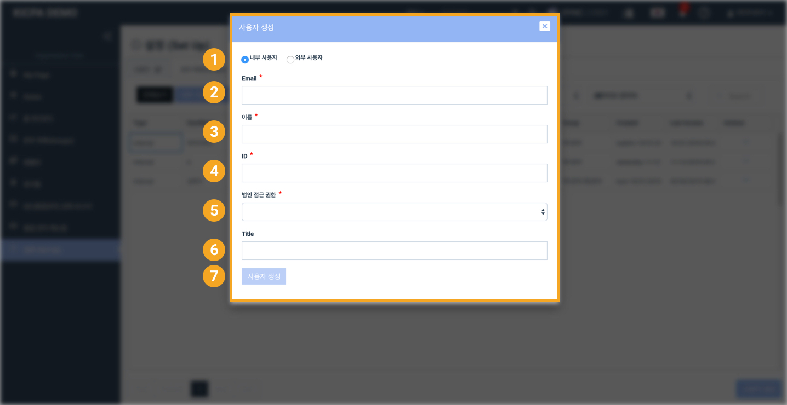
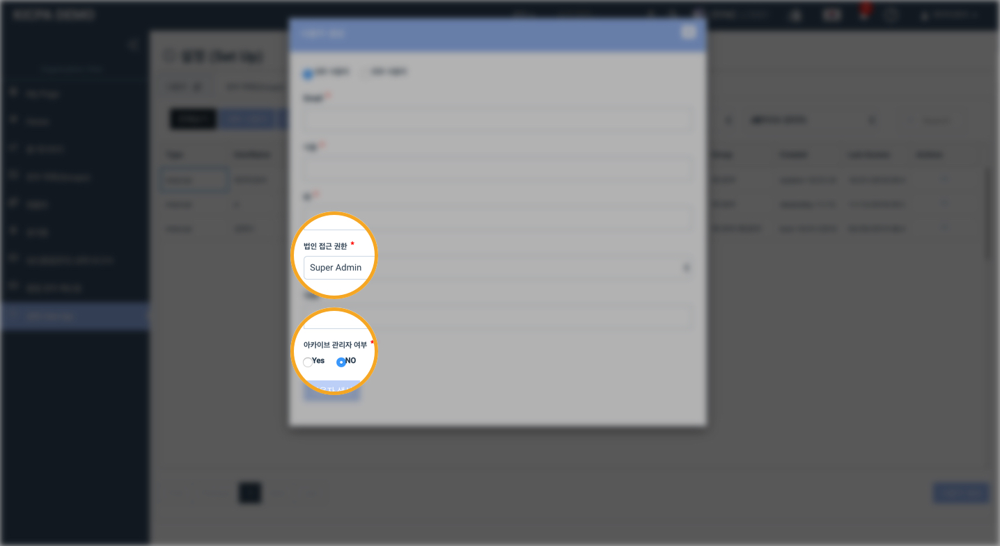
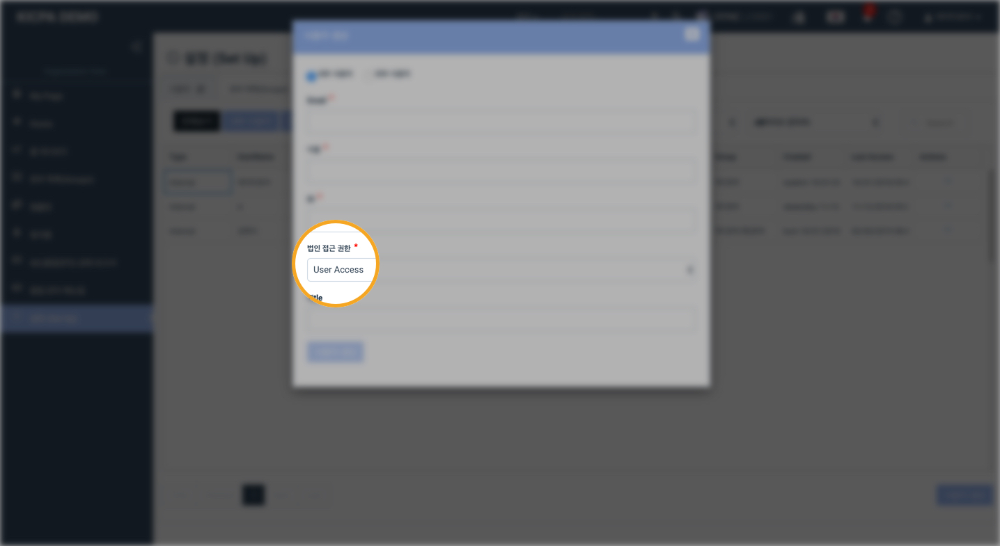

# \(ENG\)2. 사용자 등록/수정/삭제하기

## 요약보기

법인용 메뉴의 설정\(Setup\) &gt; 사용자\(User\) 를 선택한 후 화면 오른쪽 아래에서 '사용자 생성' 버튼을 눌러 사용자를 등록할 수 있습니다.

1. 내부 사용자 / 외부 사용자를 선택합니다. 
2. 추가할 사용자의 Email을 입력합니다. 
3. 추가할 사용자의 이름을 입력합니다.  
4. 추가할 사용자의 아이디를 입력합니다.  
5. 추가할 사용자의 법인 접근 권한을 선택합니다.
6. Title 란에 사용자의 부가정보를 입력합니다. \(선택사항입니다.\) 
7. '사용자 생성'을 누르고 화면 상단에 붉은색 로딩바가 완료될 때까지 기다립니다.

### 법인 접근 권한\(Access Right\)이란?

어딧로비 시스템은 크게 법인용 기능과 프로젝트용 기능으로 나눌 수 있습니다. 법인의 전반적인 관리와 관련된 메뉴를 법인용 메뉴\(Organization Menu 또는 Organization View\)라고 부르며, 여기서 어딧로비 사용자는 크게 세 유형으로 분류됩니다.

> 이 세가지 유형은 법인 전체의 어딧로비 시스템에 적용되는 권한이며, 프로젝트 내부에서의 직무\(Role\)와는 다릅니다.

1. Super Admin
2. Group Admin
3. User Access



## 상세보기

## 1. Super Admin 등록하기

> 주의: Super Admin만 사용자를 등록할 수 있습니다. Group Admin과 User Access는 사용자를 등록할 수 없습니다.

### 1-1. 기본 정보 입력

사용자 이름, 별칭\(ID\), 이메일을 입력합니다. 별칭은 차후 사용자를 보다 편하게 구분하는데 사용됩니다. 알파벳 약자를 추천합니다.

### 1-2. 사용자의 법인 접근 권한을 'Super Admin'으로 선택합니다.

### 1-3. 사용자에게 아카이브 관리자 권한이 있는지 여부를 선택합니다.

* 아카이브 관리자\(Archive Manager\) 권한이 Yes로 설정된 Super Admin 만이 법인의 아카이브 조건을 설정하거나 아카이브 된 프로젝트를 관리할 수 있습니다. 
* Super Admin 이지만 아카이브 관리자 권한이 No로 설정된 경우 법인의 아카이브 조건을 설정하거나 아카이브 된 프로젝트를 관리할 수 없습니다. 
* Group Admin 이나 User Access 에는 아카이브 관리자 권한을 부여할 수 없습니다. 

### 1-4. '생성' 버튼을 누른 후 화면 상단의 붉은색 로딩바가 완료되기를 기다립니다.

> 수정이 필요한 경우 항목의 오른쪽 끝에 있는 연필 모양 버튼을 눌러 수정할 수 있습니다.

## 2. Group Admin 등록하기

> 주의: Super Admin만 사용자를 등록할 수 있습니다. Group Admin과 User Access는 사용자를 등록할 수 없습니다.

### 2-1. 기본 정보 입력

사용자 이름, 별칭\(ID\), 이메일을 입력합니다. 별칭은 차후 사용자를 보다 편하게 구분하는데 사용됩니다. 알파벳 약자를 추천합니다.

### 2-2. 사용자의 법인 접근 권한을 'Group Admin'으로 선택합니다.

### 2-3. '생성' 버튼을 누른 후 화면 상단의 붉은색 로딩바가 완료되기를 기다립니다.

> 수정이 필요한 경우 항목의 오른쪽 끝에 있는 연필 모양 버튼을 눌러 수정할 수 있습니다.

## 3. User Access 등록하기

> 주의: Super Admin만 사용자를 등록할 수 있습니다. Group Admin과 User Access는 사용자를 등록할 수 없습니다.

### 3-1. 기본 정보 입력

사용자 이름, 별칭\(ID\), 이메일을 입력합니다. 별칭은 차후 사용자를 보다 편하게 구분하는데 사용됩니다. 알파벳 약자를 추천합니다.

### 3-2. 사용자의 법인 접근 권한을 'User Access'로 설정합니다.

### 3-3. '생성' 버튼을 누른후 화면 상단의 붉은색 로딩바가 완료되기를 기다립니다.

> 수정이 필요한 경우 항목의 오른쪽 끝에 있는 연필 모양 버튼을 눌러 수정할 수 있습니다.

## + 사용자 생성 후 사용자를 본부\(Group\)에 추가해야 합니다.

새로 생성된 **사용자를 본부에 추가하여 주십시오**. 사용자를 본부에 추가하는 방법은 ['사용자 추가/제외하기' ](5.-group/5-1..md)에서 보실 수 있습니다.


본부에 추가되지 않은 사용자는 프로젝트 생성 시 배정가능한 사용자 목록에 나타나지 않습니다.



본부에 추가되지 않은 사용자는 본부 내부 프로젝트의 목록과 내용을 볼 수 없습니다.


