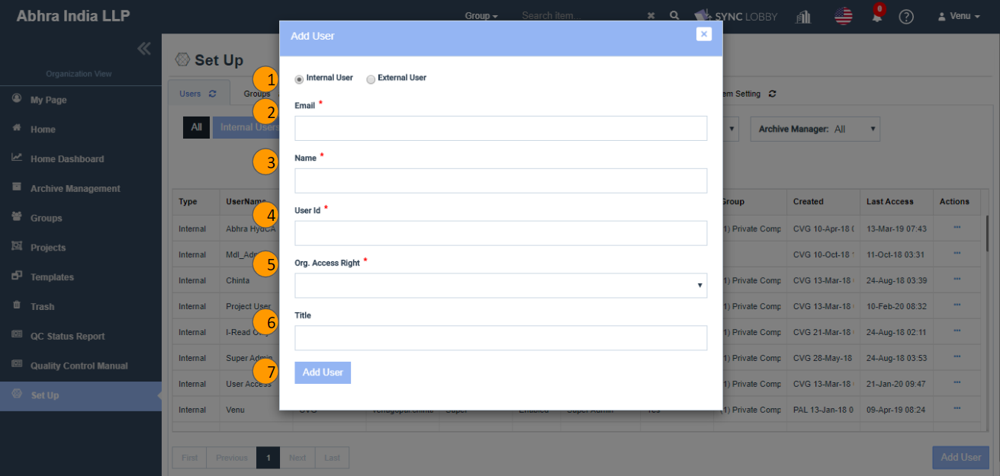
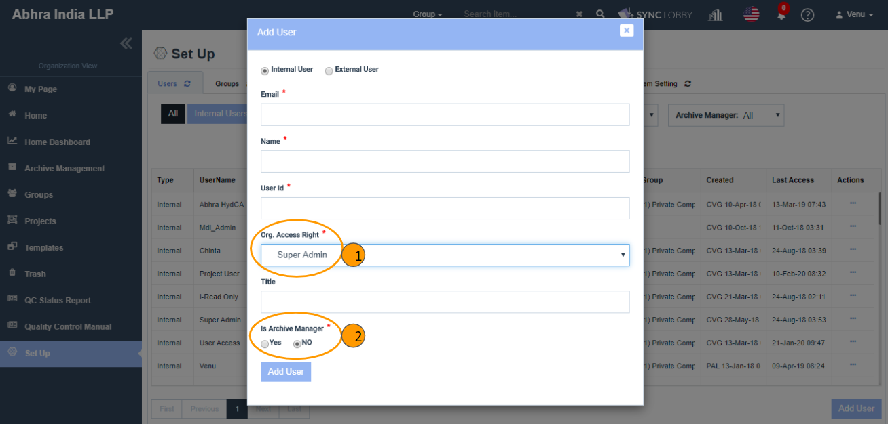
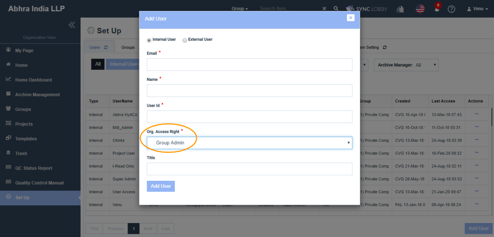
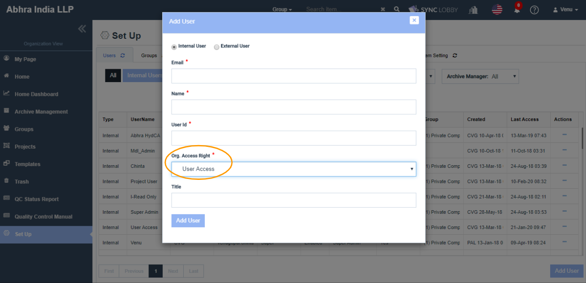

# \(Venu/Pending\)2. User Registration / Edit / Delete

## [Summary](../guide-by-function/organization-access-right.md) 

You can register a user by clicking 'Set Up &gt; Users' in the left navigation menu of the Organization View and clicking the 'Add User' button in the bottom-right corner of the screen.

1. Select Internal User or External User.
2. Enter the Email address of the new user.
3. Enter the 'Name' of the new user.
4. Enter the 'User ID' of the new user.
5. Select the 'Org. Access Right' of the new user.
6. Enter designation of the new user in the 'Title' field \(Optional\).
7. Click the 'Add User' button and wait until the red progress bar at the top of the screen is done.

### What is 'Access Right'?

The Audit LOBBY system is divided into two parts: Organization and Project functions. The menu associated with the overall management of a firm is called the Organization Menu or Organization View, and here the Audit LOBBY users are classified into three types. 

> These three types apply to the Audit LOBBY system for the firm but differ from the roles within each project.

1. Super Admin
2. Group Admin
3. User Access



## View Details  

## 1. Super Admin User Registration

> Note:  Only Super Admin users can add users. Group Admin and User Access users can not add users.

### 1-1. Enter the basic personal information.  

Enter the name, user ID, email address. Later, the User ID will be used to distinguish users more easily. It is recommended to use Alphabets for the User ID.

### 1-2. Select the Access Right as 'Super Admin'.

### 1-3. Select whether the user has the right to be an Archive Manager or not.

If you are an Archive Manager, then only you can provide 'Archive Manager' permissions to others.

1. The 'Archive Manager' permission is given only to the Super Admin users.
2. The 'Archive Manager' field with the 'Yes/ No' options gets displayed upon choosing the 'Super Admin' value in the 'Org. Access Right' drop-down.
3. Archive Manager is the person who can control the Archived and Unarchived projects from the 'Archive Management' screen.

### 1-4. Click the 'Add User' button and wait for the red progress bar at the top of the screen to be done. 

> You can make changes by clicking the pencil-shaped button at the far right of each user.

## 2. Group Admin User Registration

> Note: Only the Super Admin users can add users. Group Admin users and User Access users cannot add users.

### 2-1. Enter the basic personal information.  

Enter the name, user ID, email address. Later, the User ID will be used to distinguish users more easily. It is recommended to use Alphabets for the User ID.

### 2-2. Select the 'Org. Access Right' as 'Group Admin'.

### 2-3. Click the 'Add User' button and wait for the red progress bar at the top of the screen to be done.  

> You can make changes by clicking the pencil-shaped button at the far right of each user.

## 3. User Access User Registration

> Notice: Only the Super Admin users can add users. Group Admin users and User Access users cannot add users.

### 3-1.  Enter the basic personal information.  

Enter the name, user ID, email address. Later, the User ID will be used to distinguish users more easily. It is recommended to use Alphabets for the User ID.

### 3-2. Select the 'Org. Access Right' as 'User Access'.

### 3-3. Click the 'Add User' button and wait for the red progress bar at the top of the screen to be done.  

> You can make changes by clicking the pencil-shaped button at the far right of each user.

## + Users must be assigned to the group after the registration.  

Please **assign the newly registered user to the group**. You can find out how to add users to the Group at '[Assign/Unassign Users](5.-group/5-1..md)'. 


Users who are not assigned to the group will not appear in the list of users who can be assigned when you create a project.



Users who are not assigned to the group will not appear in the 'Email' field of the 'Administration &gt; Users' screen of the Project View.



Users who are not assigned to the group will not be able to view the list and contents of the projects of the group.


