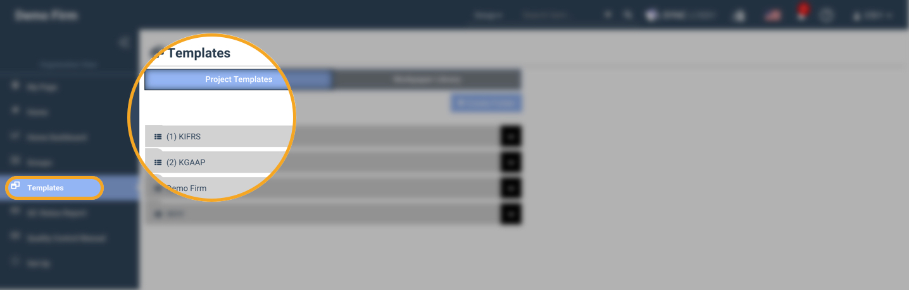

# \(Venu/Done\)8. Templates Creation

## Summary

1. The ‘Templates’ module is available on the left navigation menu of Organization View.
2. This can be accessed by Super Admin and Group Admin users.
3. But the operations like create, edit, delete can be done by Super Admin only.
4. Clicking it opens the ‘Templates’ screen.
5. It contains two tabs named ‘Project Templates’ and ‘Workpaper Library’.
6. The default selection is on ‘Project Templates’ tab.

* [8-1. Project Templates](x-1..md)
* [8-2. Workpaper Library](x-2..md)  

