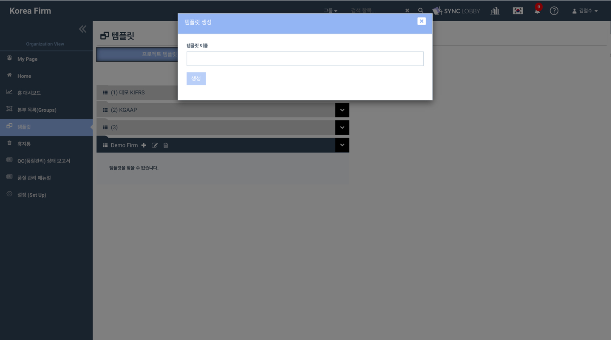

# \(Venu/Pending\)8.2. Workpaper Library

## Summary

1. Click the 'Templates' on the left navigation menu of Organization View.
2. Click the 'Workpaper Library' tab.
3. The hierarchy of the Workpaper Library is “Template folder &gt; Template subfolder &gt; Files”.
4. Both Super Admin and Group Admin users can view the screen.
5. But, the operations like create, update, delete can be performed only by the Super Admin.

### Major components of Workpaper Library

1. Template folders
2. Template subfolders
3. Files

## 1. Template Folder

### 1-1. Create template folder

> Using this, new template folders can be created.

1. Click the 'Templates' option on the left navigation menu of the Organization View.
2. Click the 'Workpaper Library' tab.
3. Click the 'Create Folder' button at the top of the page.
4. The 'Create Folder' dialog will be displayed.
5. Enter the Folder Name and click the 'Create' button.
6. A success message will be displayed on the top-right of the screen.
7. You can view the created folder on the left side of the screen.
8. This way, ‘n’ number of template folders can be created.


Duplicate template folders cannot be created.


### 1.2. Edit template folder

> Using this, name for existing template folders can be updated.

1. Find the template folder that you wish to revise the name.
2. Click on it to view the action items of it.
3. Clicking the 'Edit' icon displays the 'Edit Folder' dialog.
4. Enter the revised folder name and click the 'Update' button.
5. You can view the success message and the updated name.


Duplicate names are not allowed for the template folders while update.


### 1.3. Delete template folder

> Using this, existing template folders can be deleted.

1. Find the template folder that you wish to delete.
2. Click on it to view the action items of it.
3. Clicking the 'Delete' icon displays the deleted confirmation alert.
4. Click the 'OK' button in the confirmation alert.
5. You can view the delete success message and the folder will be disappeared from the screen.


With this delete, the entire template folder structure \(Template folder, Template subfolders,  Files\) will get deleted.



Deleted Template folder can be restored from the ‘Trash’ screen by super admin only.


### 1.4. Copy template folder

> Using this, template folders can be duplicated.

1. Find the template folder that you wish to duplicate.
2. Click on it to view the action items of it.
3. Clicking the 'Copy this folder' icon displays the confirmation alert for duplication.
4. Clicking 'YES' begins the duplication process.
5. You can view the below message on the top right of the screen.
   * Your request for copying has been submitted. You will receive a mail after coping
6. You will receive the email notification about the copy status once the copying gets done.
7. Refresh the screen to view the duplicated template folder.


With this copy, the entire structure \(Template folder, Template subfolders, Files\) will be duplicated.

The duplicated template folder will be suffixed with '-1' and the number gets auto-increment for the next iteration.


### 1.5. Sort template folders

> Using this, template folders can be sorted in ascending \(A-Z\)/ descending \(Z-A\) order.

1. By default, the template folders will be displayed in alphabetical order \(A-Z\).
2. Click the 'Sort' icon at the top-left of the screen for sorting the folders in descending \(Z-A\)/ ascending \(A-Z\) order.

## 2. Template subfolder

### 2.1. Create Workpaper/ Audit Program template subfolder 

> Using this, you can create Workpaper Templates and Audit Program Templates.

1. Find the template folder to which you wish to add a subfolder.
2. Click on it to view the action items of it.
3. Clicking the 'Create New Template' icon displays the 'Create Template' dialog.
4. You can view two radio buttons: Workpaper Template, Audit Program Template.
5. Select the intended radio button.
6. Enter the template subfolder name and click the 'Create' button.
7. You can view the created template subfolder under the template folder.
8. This way, ‘n’ number of template subfolders can be created under a template folder.

### 2.2. Edit template subfolder

> Using this, name for existing template subfolders can be updated.

1. Find the template subfolder that you wish to revise the name.
2. Click the 'Edit' icon located next to the subfolder.
3. The 'Edit Template' dialog will be displayed.
4. Enter the revised name.
5. Click the 'Update' button.
6. You can view the success message and the updated name.


Within a template folder, duplicate names are not allowed for template subfolders while update.


### 2.3. Delete template subfolder

> Using this, existing template subfolders can be deleted.

1. Find the template subfolder that you wish to delete.
2. Click the 'Delete' icon presented next to the subfolder name.
3. The delete confirmation alert will be displayed.
4. Click the 'OK' button in the confirmation alert.
5. You can view the delete success message and the subfolder will be disappeared from the screen.


With this delete, the entire template subfolder structure \(Template subfolders, folders & files\) will get deleted.



Deleted Template subfolder can be restored from the ‘Trash’ screen by super admin only.


### 2.4. Copy template subfolder

> Using this, template subfolders can be duplicated.

1. Find the template subfolder that you wish to duplicate.
2. Click the 'Copy this folder' icon presented next to the subfolder name.
3. The confirmation alert for duplication will be displayed.
4. Clicking 'YES' begins the duplication process.
5. You can view the below message on the top right of the screen.
   * Your request for copying has been submitted. You will receive a mail after coping
6. You will receive the email notification once the copying is done about the status.
7. Refresh the screen to view the duplicated template subfolder.


With this copy, the entire template subfolder structure \(Template subfolders, Folders & Files\) will be duplicated.

The duplicated template subfolder will be suffixed with '-1' and the number gets auto-increment for the next iteration.


### 2.5. Sort template subfolders

> Using this, template subfolders can be sorted in ascending \(A-Z\)/ descending \(Z-A\) order.

1. By default, the template subfolders will be displayed in alphabetical order \(A-Z\).
2. Find the template folder in which you wish to sort the subfolders.
3. Click the 'Sort' icon next to the copy icon for sorting the subfolders in descending \(Z-A\)/ ascending \(A-Z\) order.

