# \(Venu/Pending\)8-1. Project Templates

## Summary

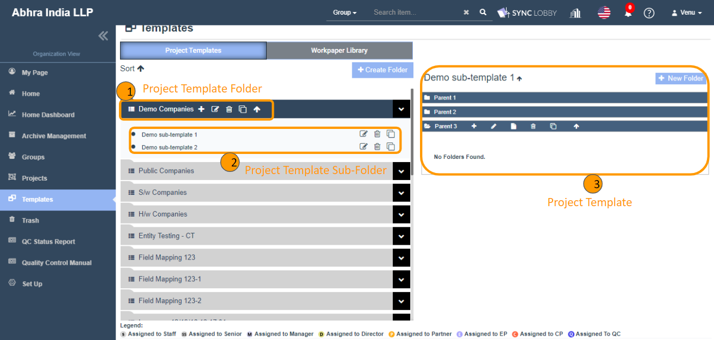

* The ‘Project Templates’ is a place where all the repeated documents will be stored in the folder-file structure and can be utilized in the ‘Step 2’ of ‘the Create Project’ window.
* The hierarchy of the Project Templates is “Template Folders &gt;&gt; Template Subfolders  &gt;&gt; Folders & Files”.

### Major components of Project Templates

1. Template Folder
   1. Create template folder
   2. Edit template folder
   3. Delete template folder
   4. Copy template folder
   5. Sort template folders
   6. Create template subfolder
2. Template subfolders
   1. Create template subfolder
   2. Edit template subfolder
   3. Delete template subfolder
   4. Copy template subfolder
   5. Sort template subfolders
   6. Create project template
3. Folders & Files
4. Assign files to Roles

## 1. Template Folder

### 1-1. Create template folder

> Using this, new template folders can be created.

1. Click the 'Templates' option on the left navigation menu of the Organization View.
2. Click the 'Project Templates' tab \(Default selection is the Project Templates tab\).
3. Click the 'Create Folder' button at the top the page.
4. The 'Create Folder' dialog will be displayed.
5. Enter the folder name.
6. Click 'Create' button.
7. You can see the created folder on the left side of the screen.
8. This way, ‘n’ number of template folders can be created.


Duplicate template folders cannot be created.


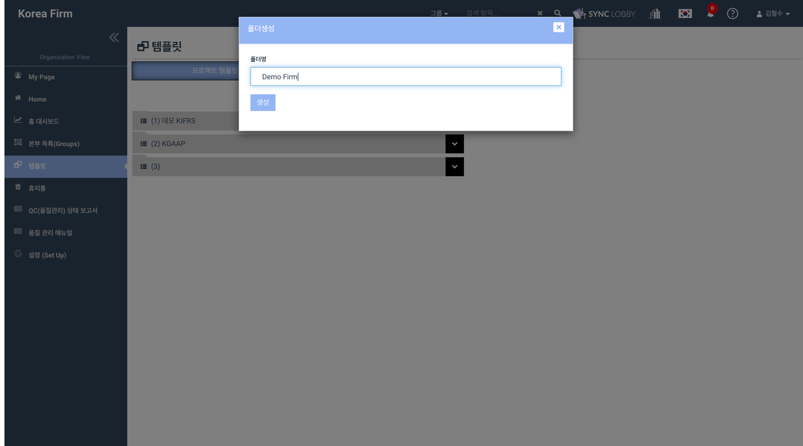

### 1.2. Edit template folder

> Using this, name for existing template folders can be updated.

1. Find the template folder that you wish to revise the name.
2. Click on it to view the action items to it.
3. Clicking the 'Edit' icon displays the 'Edit Folder' dialog.
4. Enter the revised folder name.
5. Click the 'Update' button.
6. You can view the success message and the updated name.


Duplicate names are not allowed for the template folders while update.


### 1.3. Delete template folder

> Using this, existing template folders can be deleted.

1. Find the template folder that you wish to delete.
2. Click on it to view the action items to it.
3. Clicking the 'Delete' icon displays the deleted confirmation alert.
4. Click the 'OK' button in the confirmation alert.
5. You can view the delete success message and the folder will be disappeared from the screen.


With this delete, the entire template folder structure \(Template folder, Template subfolders, Folders & Files\) will get deleted.



Deleted Template folder can be restored from the ‘Trash’ screen by super admin only.


### 1.4. Copy template folder

> Using this, template folders can be duplicated.

1. Find the template folder that you wish to duplicate.
2. Click on it to view the action items to it.
3. Clicking the 'Copy this folder' icon displays the confirmation alert for duplication.
4. Clicking 'YES' begins the duplication process.
5. You can view the below message on the top right of the screen.
   * Your request for copying has been submitted. You will receive a mail after coping
6. You will receive the email notification once the copying is done about the status.
7. Refresh the screen to view the duplicated template folder.


With this copy, the entire structure \(Template folder, Template subfolders, Folders & Files\) will be duplicated.

The duplicated template folder will be suffixed with '-1' and the number gets auto-increment for the next iteration.


### 1.5. Sort template folders

> Using this, template folders can be sorted in ascending \(A-Z\)/ descending \(Z-A\) order.

1. By default, the template folders will be displayed in alphabetical order \(A-Z\).
2. Click the 'Sort' icon at the top-left of the screen for sorting the folders in descending \(Z-A\)/ ascending \(A-Z\) order.

## 2. Template subfolder

### 2.1. Create template subfolder

1. Find the template folder to which you wish to add a subfolder.
2. Click on it to view the action items to it.
3. Clicking the 'Create New Template' icon displays the 'Create Template' dialog.
4. Enter the template subfolder name.
5. Click the 'Create' button.
6. You can see the created template subfolder under the template folder.
7. This way, ‘n’ number of template subfolders can be created under a template folder..

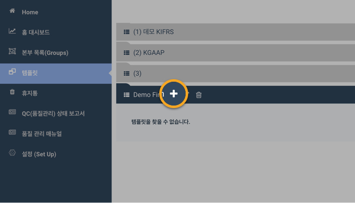

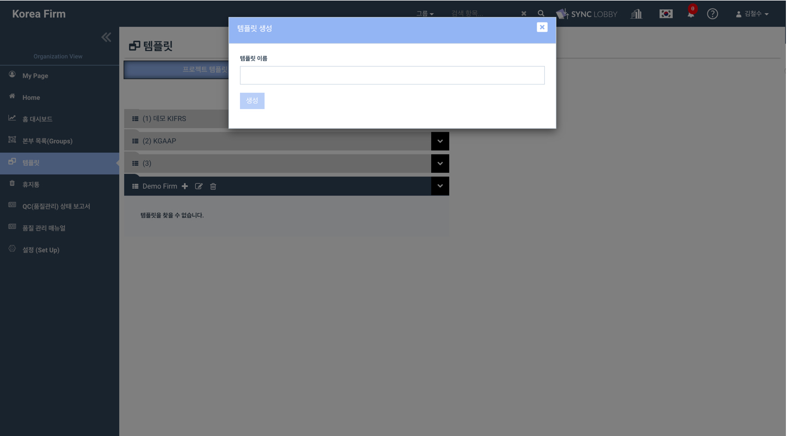

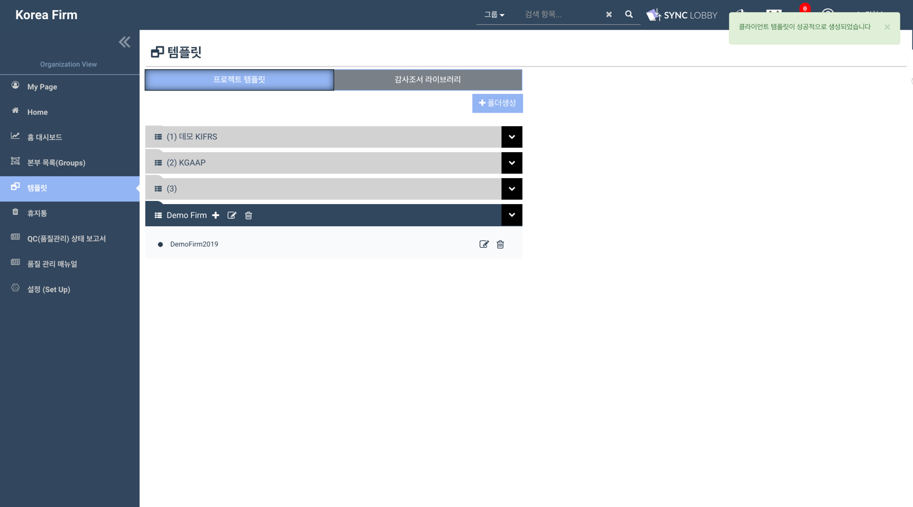

### 2.2. Edit template subfolder

> Using this, name for existing template subfolders can be updated.

1. Find the template subfolder that you wish to revise the name.
2. Click the 'Edit' icon located next to the subfolder.
3. The 'Edit Template' dialog will be displayed.
4. Enter the revised name.
5. Click the 'Update' button.
6. You can view the success message and the updated name.


Within a template folder, duplicate names are not allowed for template subfolders while update.


### 2.3. Delete template subfolder

> Using this, existing template subfolders can be deleted.

1. Find the template subfolder that you wish to delete.
2. Click the 'Delete' icon presented next to the subfolder name.
3. The delete confirmation alert will be displayed.
4. Click the 'OK' button in the confirmation alert.
5. You can view the delete success message and the subfolder will be disappeared from the screen.


With this delete, the entire template subfolder structure \(Template subfolders, folders & files\) will get deleted.



Deleted Template subfolder can be restored from the ‘Trash’ screen by super admin only.


### 2.4. Copy template subfolder

> Using this, template subfolders can be duplicated.

1. Find the template subfolder that you wish to duplicate.
2. Click the 'Copy this folder' icon presented next to the subfolder name.
3. The confirmation alert for duplication will be displayed.
4. Clicking 'YES' begins the duplication process.
5. You can view the below message on the top right of the screen.
   * Your request for copying has been submitted. You will receive a mail after coping
6. You will receive the email notification once the copying is done about the status.
7. Refresh the screen to view the duplicated template subfolder.


With this copy, the entire template subfolder structure \(Template subfolders, Folders & Files\) will be duplicated.

The duplicated template subfolder will be suffixed with '-1' and the number gets auto-increment for the next iteration.


### 2.5. Sort template subfolders

> Using this, template subfolders can be sorted in ascending \(A-Z\)/ descending \(Z-A\) order.

1. By default, the template subfolders will be displayed in alphabetical order \(A-Z\).
2. Find the template folder in which you wish to sort the subfolders.
3. Click the 'Sort' icon next to the copy icon for sorting the subfolders in descending \(Z-A\)/ ascending \(A-Z\) order.

## 3. Folders & Files

> Folders & files can be added to the template subfolder. This is the data that will be cloned into the Workpaper screen when a project is created using the Templates.

### 3.1. Create parent folder

1. Click the template subfolder that you wish to add folders & files.
2. On the RHS of the screen, you can view the ‘New Folder’ button to create the parent folders.
3. Click the 'New Folder' button displays the 'Create Folder' dialog.
4. Enter the name of the folder and click the 'Create' button.
5. The create success message will be displayed on the top-right of the screen.
6. You can view the created parent folder on the RHS of the screen.
7. This way, ‘n’ number of parent folders can be created under a template subfolder.

### 3.2. Create child folder

1. Find the folder in which you wish to add child folder.
2. Click it to view the below actions items next to the folder name.
   * Create Folder, Edit Folder, Create File, Delete Folder, Copy this folder, Sort Ascending
3. Clicking the 'plus' \(create folder\) icon displays the 'Create Folder' dialog.
4. Enter the name of the folder and click the 'Create' button.
5. The create success message will be displayed on the top-right of the screen.
6. You can view the created child folder under the parent folder.
7. This way, ‘n’ number of child folders can be created under a folder.

### 3.2. Edit parent/ child folder

> Using this, name for existing folders can be updated.

1. Find the folder that you wish to revise the name.
2. Click it to view the below actions items next to the folder name.
   * Create Folder, Edit Folder, Create File, Delete Folder, Copy this folder, Sort Ascending
3. Clicking the 'Edit Folder' icon displays the 'Edit Template' dialog.
4. Enter the revised name and click the 'Update' button.
5. You can view the success message and the updated name for the folder.
6. The edit process is same for the parent & child folders.


Within a template subfolder, duplicate names are not allowed for folders while update.


### 3.3. Delete parent/ child folder

> Using this, existing folders can be deleted.

1. Find the folder that you wish to delete.
2. Click it to view the below actions items next to the folder name.
   * Create Folder, Edit Folder, Create File, Delete Folder, Copy this folder, Sort Ascending
3. Click the 'Delete' icon \(Delete Folder\) presented next to the folder name.
4. The delete confirmation alert will be displayed.
5. Click the 'OK' button in the confirmation alert.
6. You can view the delete success message and the folder will be disappeared from the screen.


With this delete, the entire folder structure \(folder, its child folder & files\) will get deleted.



Deleted folder can be restored from the ‘Trash’ screen by super admin only.


### 3.4. Create File

> Using this, You can add files to the parent/ child folders. Files can be created in two ways.
>
> 1. New File
> 2. Multiple Files

#### 3.4.1. New File

1. Find the folder to which you wish to add files.
2. Click it to view the below action items next to the folder name.
   * Create Folder, Edit Folder, Create File, Delete Folder, Copy this folder, Sort Ascending
3. Clicking the 'Create File' icon displays the 'Create Template File' dialog.
4. Select the 'New File' radio button.
5. Enter the reference number in the "Workpaper Reference" text field.
6. The 'Workpaper Type' is a drop-down contains four values: Excel, Word, Pdf, Audit Program. You can choose the intended type from the list.
7. Enter the file description in the 'Workpaper Title' text field.
8. Click the 'Create' button.
9. You can view the create success message at the top-right of the screen.
10. You can view the created file under the respective folder.


Files with the duplicate reference numbers cannot be created within a template subfolder.


#### 3.4.2. Multiple Files

1. Find the folder to which you wish to add files.
2. Click it to view the below action items next to the folder name.
   * Create Folder, Edit Folder, Create File, Delete Folder, Copy this folder, Sort Ascending
3. Clicking the 'Create File' icon displays the 'Create Template File' dialog.
4. Select the 'Multiple Files' radio button.
5. Clicking the ‘Upload Files’ button opens the file selection window.
6. Select one or more files using the CTRL key and hit the ENTER key.
7. Chosen files will be added to the ‘Create Template File’ dialog.
8. Enter the reference number for the file\(s\) under the 'Ref Num.' column.
9. Revise the file name if required under the 'Workpaper Name' column.
10. Click the 'Create' button.
11. You can view the create success message at the top-right of the screen.
12. You can view the created file\(s\) under the respective folder.


You can add a maximum of 10 files and the max size of each file should be 30 MB only.



Files with the duplicate reference numbers cannot be allowed in the 'Multiple Files' dialog.


> You can split the ‘Workpaper Name’ into two fields such as ‘Ref Num’ and ‘Workpaper Name’ by selecting the checkbox ‘Do you want to apply a specific separator to split ref num and workpaper name?’ and inputting the required separator in ‘Separator’ field and clicking the ‘Apply’ button.
>
> * Say the original Workpaper Name is ‘1-1\_This is Sample excel file’.
> * Select the checkbox ‘Do you want to apply a specific separator to split ref num and workpaper name?’
> * Enter the '\_' in the 'Separator' field.
> * Click the 'Apply' button.
> * Then, ‘1-1’ will be displayed under the ‘Ref Num’ column and ‘This is Sample excel file’ will be displayed under the ‘Workpaper Name’ column.

### 1-3. Creating subfolders in a template

1. Click a template and you will see the list of templates on the right side of the screen
2. Click the '+ New Folder' button on the right side of the name of the selected template
3. Enter the name of the subfolder and click 'Create'
4. To make another subfolder in the new subfolder click the '+' icon on the right side of the folder name
5. Enter the folder name and click 'Create'

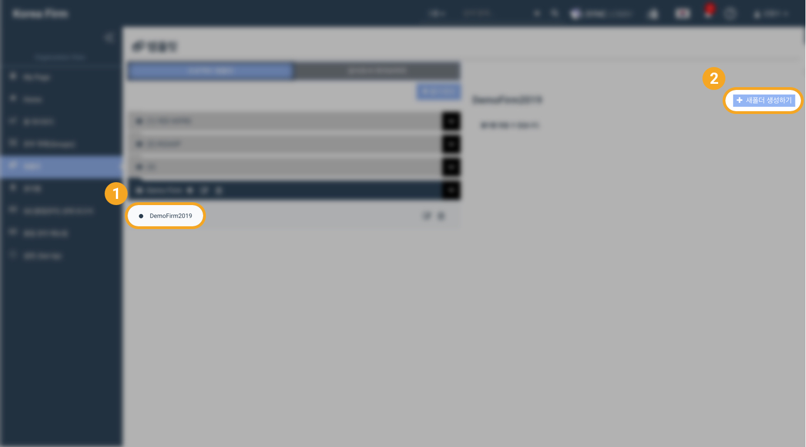

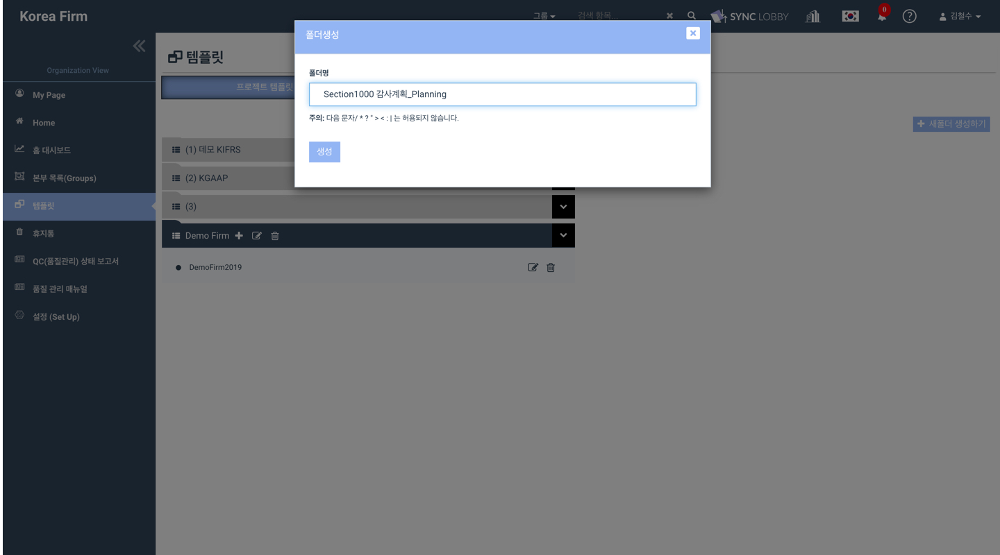

#### How to make a subfolder  

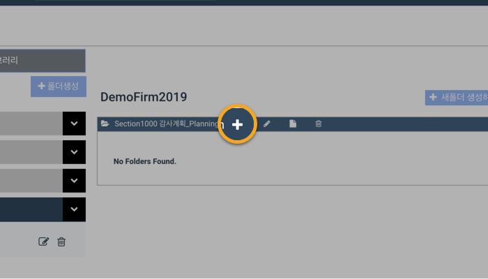

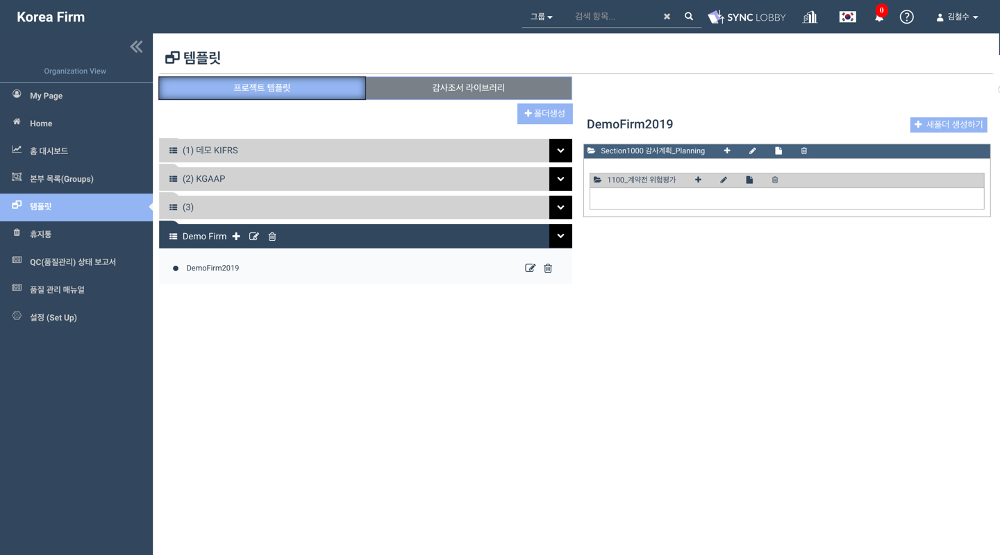

## 2. **Creating / Uploading a project template**  

1. You can make a template file\(document\) by clicking the document icon on the right side of the name of the selected folder 
2. Otherwise you can upload an existing document by dragging and dropping.
3. Find the file that you want to upload
4. Drag the file to the folder
5. Enter the workpaper reference and workpaper title and click 'Create'

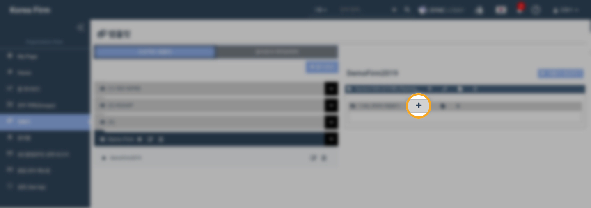

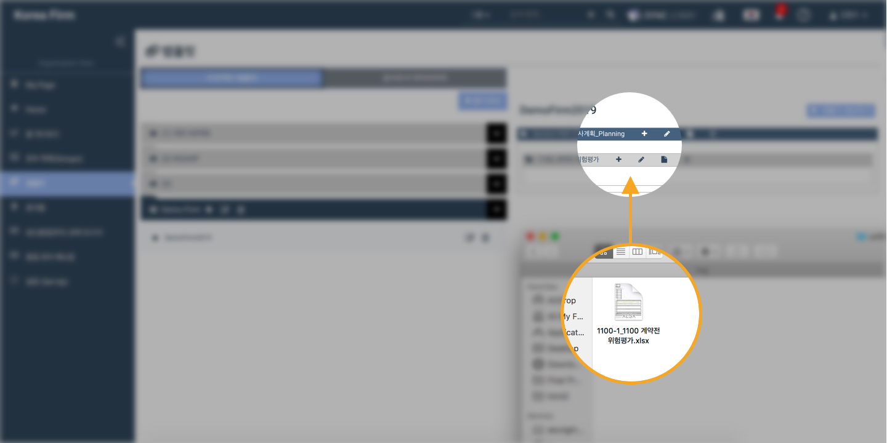

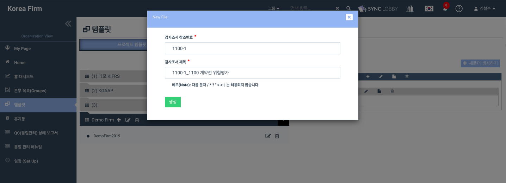

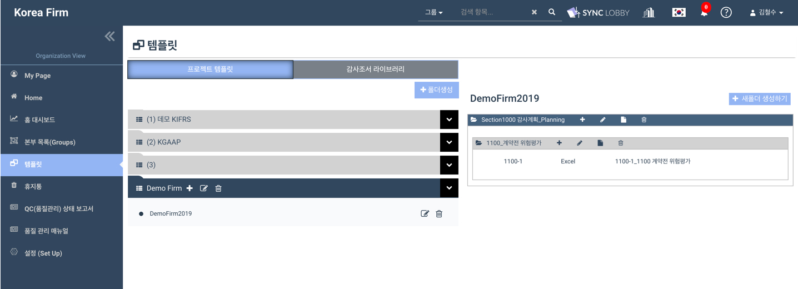

## 3. **Assigning a project template to QC**

1. Click a document that needs to be assigned to QC
2. Right click the document and click 'Assign to QC'
3. Click the 'OK' button on the 'Are you sure you want to assign this file to QC?' pop-up window
4. The document that is assigned to QC will be marked with a green circle on the left side

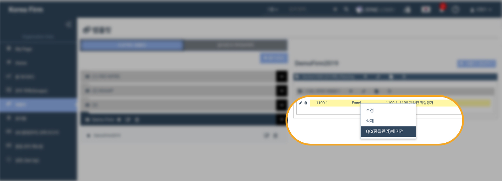

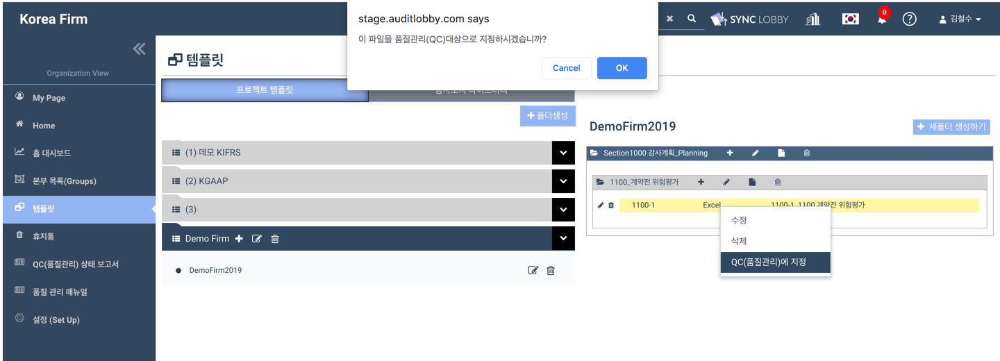

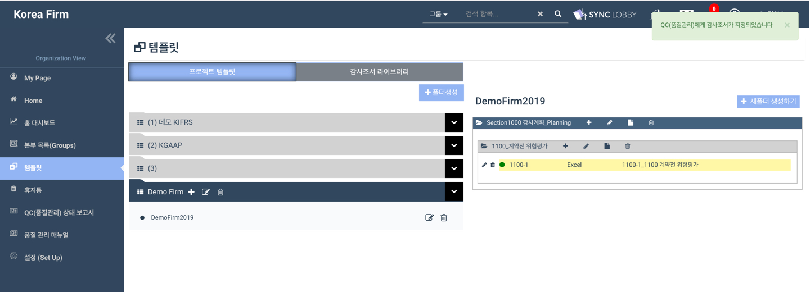

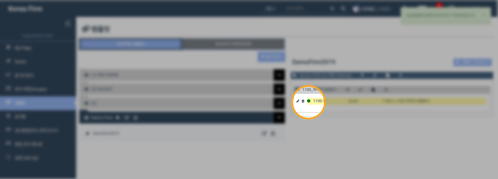

