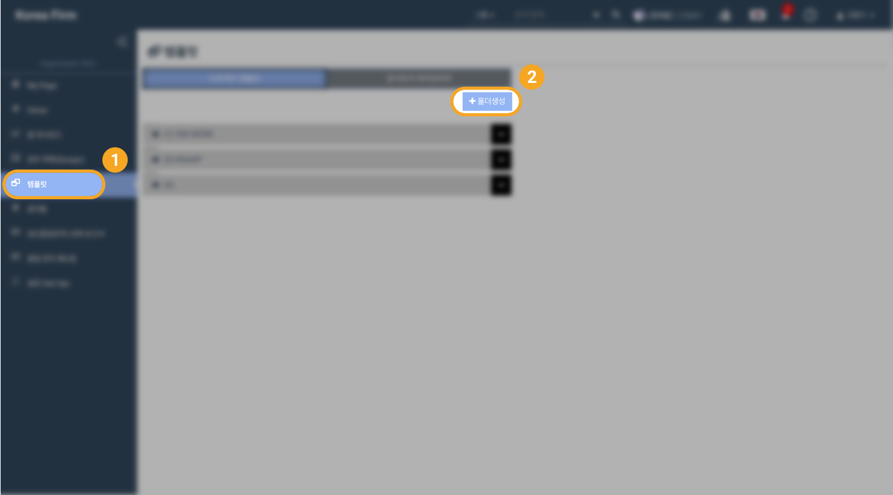

# \(ENG\)8-1. 프로젝트 템플릿 생성

프로젝트 템플릿은 폴더구조로 구성되며 생성 과정은 다음과 같습니다.

> 1. 프로젝트 템플릿 폴더 및 내부 구성   
> 2. 프로젝트 템플릿 생성   
> 3. 프로젝트 템플릿 중 품질관리\(QC\)대상 문서 지정

## 1. 프로젝트 템플릿 폴더 및 내부 구성

### 1-1. 템플릿 폴더 생성

1. Organization Home 화면의 왼쪽 메뉴 목록에서 '템플릿'을 선택합니다. 
2. Project Templetes 탭을 선택한 후, 화면 우측 상단의 '폴더 생성' 버튼을 누릅니다.
3. 폴더명을 입력합니다.
4. '생성' 버튼을 누릅니다.
5. 생성한 폴더가 화면 좌측에 나타납니다.  

### 1-2. 폴더 내부에 템플릿 생성

1. 템플릿을 생성할 폴더를 선택합니다.  
2. 선택한 폴더 이름 우측에서 '+' 모양 아이콘을 클릭합니다.
3. 생성할 템플릿 이름 입력 후 '생성' 버튼을 누릅니다.

### 1-3. 템플릿 내부 구성

1. 생성한 템플릿을 선택하면 화면 오른쪽에 템플릿 목록이 나타납니다. \(기본화면은 비어있습니다. \)  
2. 선택한 템플릿 이름 우측에 '새폴더 생성하기' 버튼을 눌러 템플릿 내부 폴더를 생성합니다.
3. 생성할 템플릿 내부 폴더의 이름을 입력한 후 '생성' 버튼을 누릅니다.
4. 내부 폴더 안에 하위 폴더를 생성하기 위해 내부 폴더 제목 옆의 '+' 버튼을 클릭합니다. 
5. 폴더명을 입력하고 '생성'버튼을 클릭합니다.

#### 하위 폴더 만들기

## 2. 프로젝트 템플릿 만들기 / 업로드하기

1. 선택 폴더 이름 우측에서 문서모양 아이콘을 눌러 템플릿 파일\(문서\)을 만들 수 있습니다.
2. 또는 드래그 앤 드롭을 통해 기존의 문서를 업로드할 수 있습니다.
3. 업로드할 파일을 준비합니다
4. 파일을 드래그 하여 폴더 상자 안에 넣습니다.
5. 제목과 참조번호를 작성하여 생성 버튼을 클릭하면 생성이 완료됩니다.  

## 3. 프로젝트 템플릿 중 품질관리\(QC\) 대상 문서 지정

1. 품질관리\(QC\)가 필요한 문서를 선택합니다.
2. 우클릭 후 'QC\(품질관리\)에 지정'을 선택합니다.
3. '이 파일을 QC에 지정하겠습니까?' 팝업이 나타나면 확인을 클릭합니다.
4. 품질관리\(QC\)를 지정한 문서의 왼쪽에 초록색 동그라미로 품질관리 대상임이 표시됩니다.  

