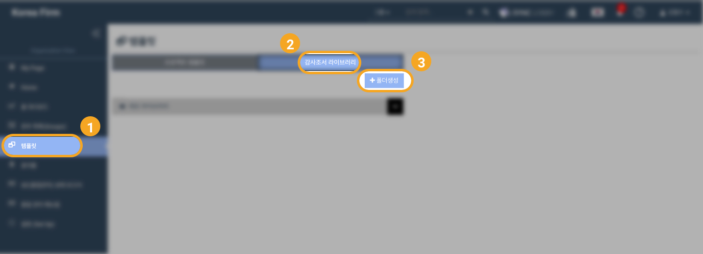
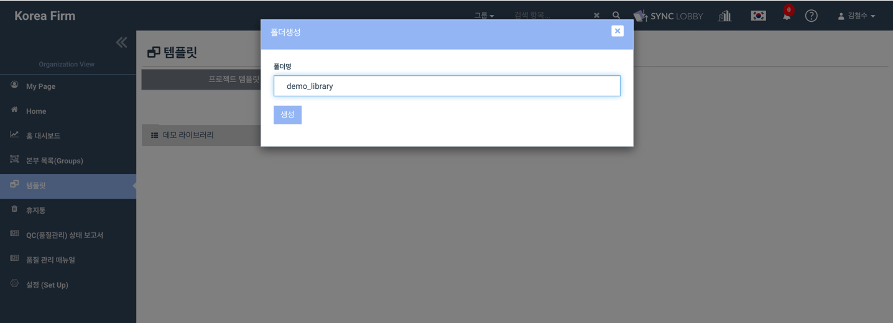
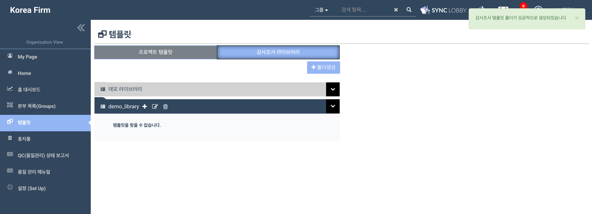
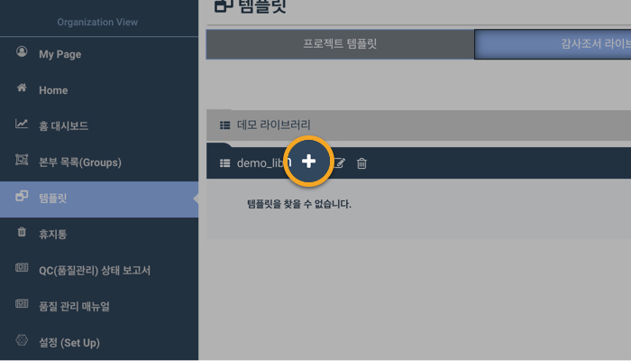
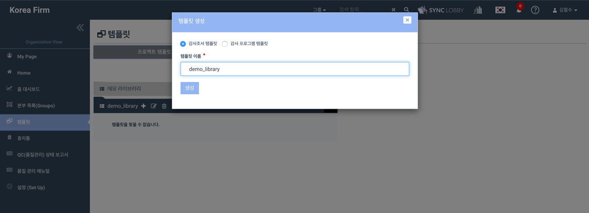
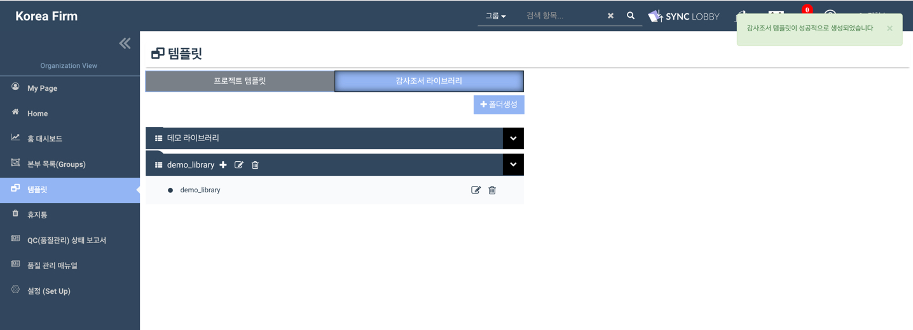
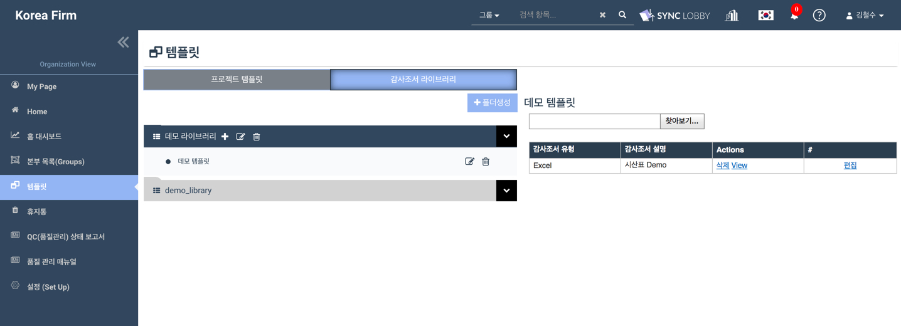
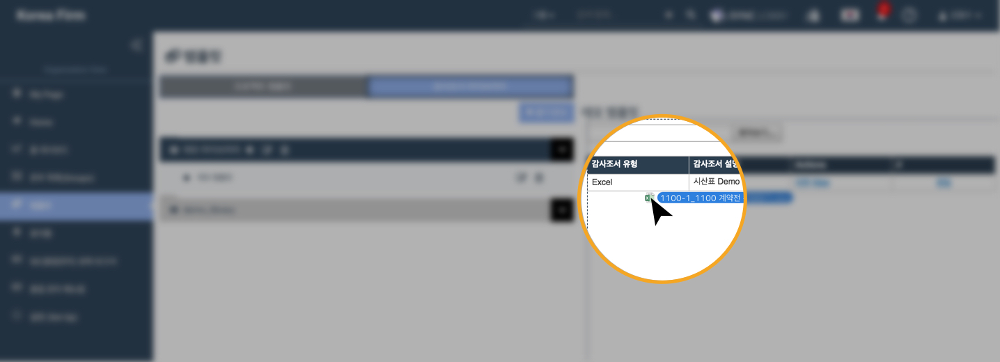

# \(ENG\)8-2. 감사조서 라이브러리

## 1. Creating a Folder in Workpaper Library

1. Click the 'Templates' button from the left menu column of the Organization View
2. Click the 'Workpaper Library' tab and click the '+ Create Folder' button at the top right of the page
3. Enter the folder name
4. Click 'Create'
5. You will see the created folder on the left side of the screen

## 2. Creating a Workpaper Library Template

1. Click a folder that you want to make a template in
2. Click the '+' icon on the right side of the selected folder
3. Check if the workpaper template is selected
4. Enter the template name and click 'Create'
5. Otherwise you can upload an existing document by dragging and dropping

### 

#### Uploading a file by dragging and dropping

