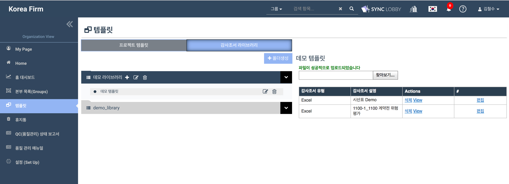

# \(ENG\)8-2. 감사조서 라이브러리

## 1. 감사조서 라이브러리  폴더 생성

1. Organization Home 화면의 왼쪽 메뉴 목록에서 '템플릿'을 선택합니다. 
2. **감사조서 라이브러리 탭**을 선택한 후,  화면 우측 상단의 '폴더생성' 버튼을 누릅니다.
3. 폴더명을 입력합니다.
4. '생성' 버튼을 누릅니다.
5. 생성한 폴더가 화면 좌측에 나타납니다.  

## 2. 감사조서 라이브러리 템플릿 생성

1. 템플릿을 생성할 폴더를 클릭합니다.
2. 선택한 폴더 이름 우측의 '+' 아이콘을 클릭합니다.
3. 감사조서 템플릿이 선택된 것을 확인합니다.
4. 생성할 템플릿 이름 입력 후 '생성' 버튼을 누릅니다.
5. 또는 드래그 앤 드롭을 통해 기존 문서를 업로드할 수 있습니다.

### 드래그 앤 드랍으로 파일 올리기

