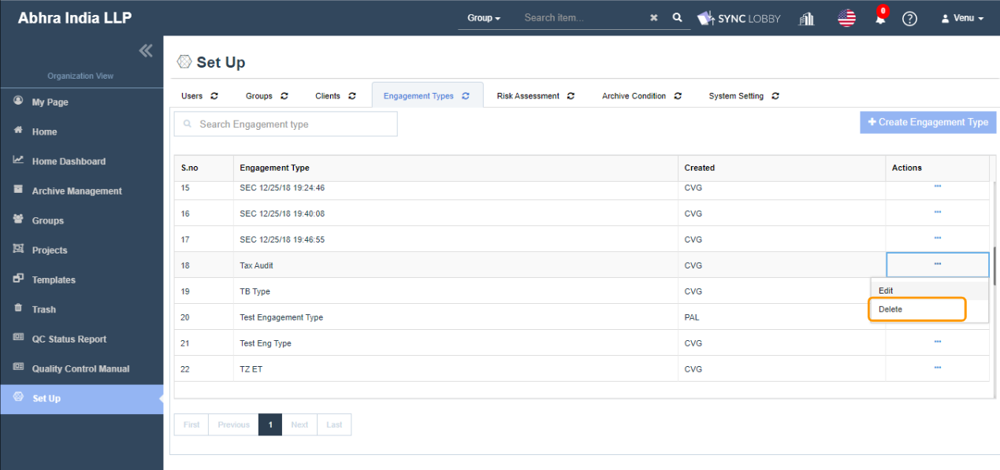

# \(Venu/Done\)6. Engagement Type Registration / Edit / Delete

## Creating an Engagement Type

1. Click the 'Set Up' button on the left navigation menu of the Organization View.
2. Click the 'Engagement Types' tab at the top of the 'Set Up' page.
3. Click the 'Create Engagement Type' button at the top right of the page.
4. Enter the engagement type name and click 'Create' button.
5. You will see a success message on the top-right corner of the screen.

## Editing an Engagement Type

1. Click the 'Set Up' button on the left navigation menu of the Organization View.
2. Click the 'Engagement Types' tab at the top of the 'Set Up' page.
3. Find the engagement type that you wish to edit.
4. Click the three dots button of the engagement type at far right of the screen.
5. Click the 'Edit' option.
6. Enter a new engagement type name and click the 'Update' button.
7. You will see a success message on the top-right corner of the screen.

## Deleting an Engagement Type  

1. Click the 'Set Up' button from the left navigation menu of the Organization View.
2. Click the 'Engagement Types' tab at the top of the 'Set Up' page.
3. Find the engagement type that you wish to delete.
4. Click the three dots button of the engagement type at far right of the screen.
5. Click the 'Delete' option.
6. Click the 'OK' button on the 'Do you really want to delete the Engagement Types?' confirmation alert.
7. You will see a success message on the top-right corner of the screen.

