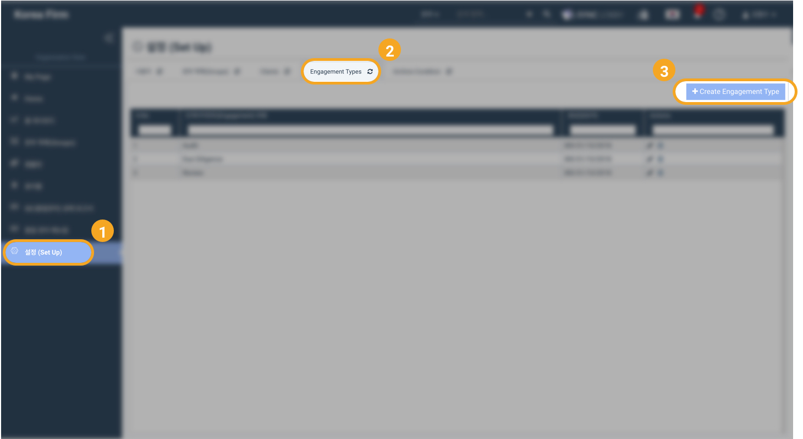
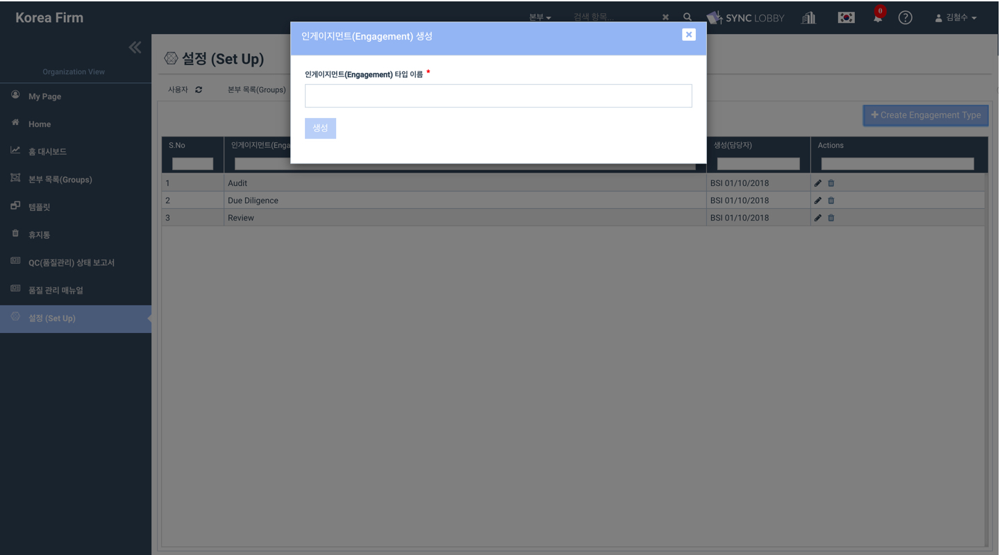
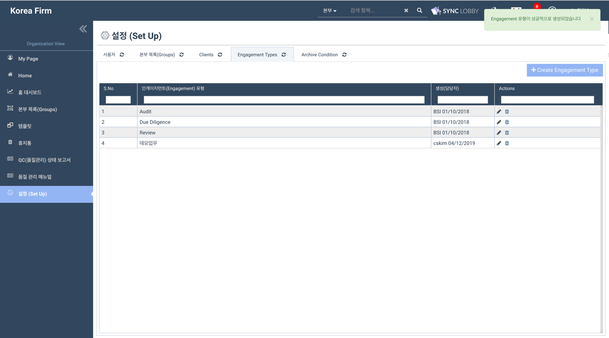
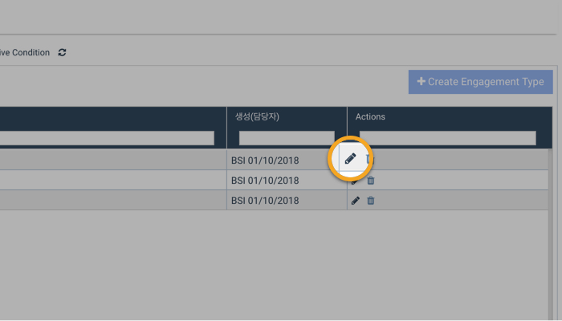
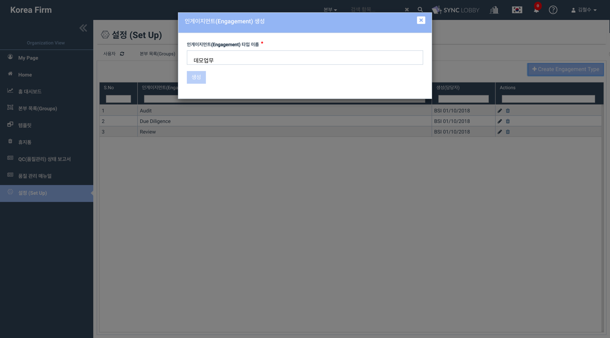
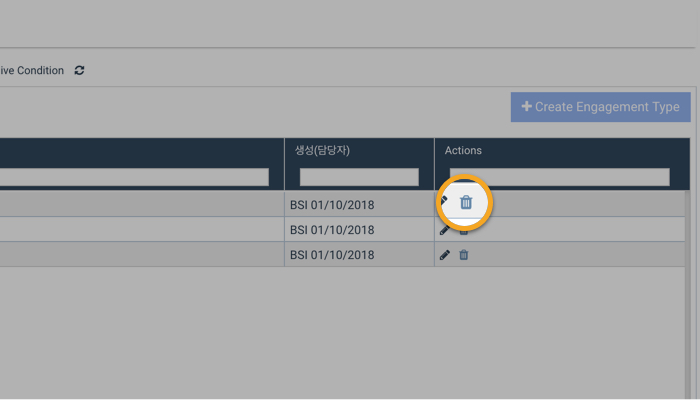
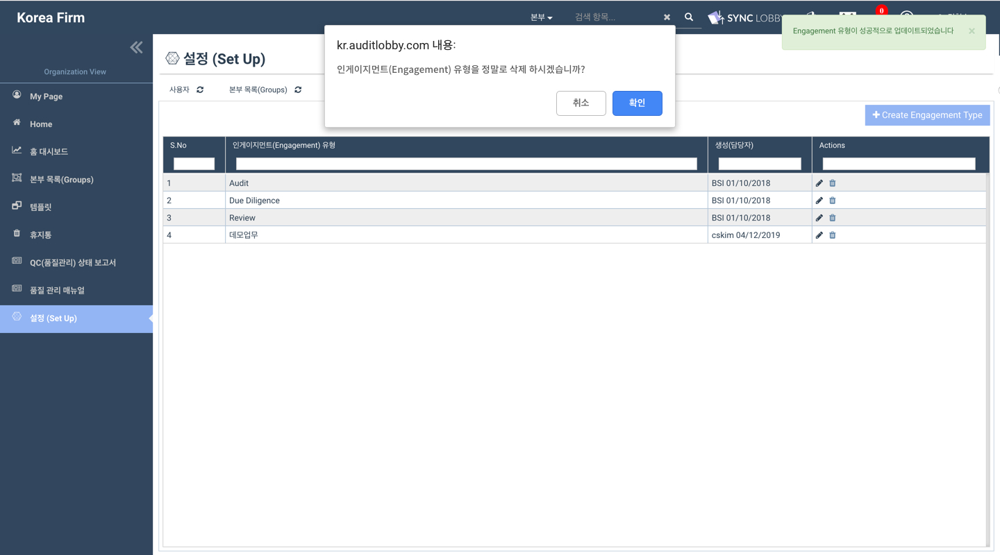
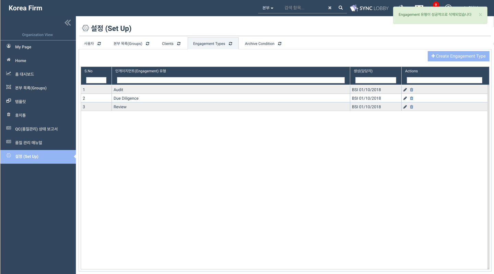

# \(ENG\)6. 업무유형 등록/수정/삭제\(Engagement Type\)

## 업무유형 등록하기

1. Organization View 화면의 왼쪽 메뉴 목록에서 '설정\(Set Up\)'을 선택합니다. 
2. '설정\(Set Up\)' 화면에서 '업무유형\(Engagement Type\)' 탭을 선택합니다. 
3. 화면 우측 상단의 '생성' 버튼을 클릭합니다. 
4. 업무 유형의 이름을 입력하고 '생성' 버튼을 누릅니다.
5. 'Engagement 유형이 성공적으로 생성되었습니다' 알림창이 화면 우측 상단에 나타납니다.   

## 업무유형 수정하기

1. Organization View 화면의 왼쪽 메뉴 목록에서 '설정\(Set Up\)'을 선택합니다. 
2. '설정\(Set Up\)' 화면에서 '업무유형\(Engagement Type\)유' 탭을 선택합니다. 
3. 수정하려는 업무유형의 오른쪽 끝에서 연필모양 버튼을 클릭합니다. 
4. 인게이지먼트\(Engagement\)타입 명의 이름을 수정하고 '업데이트' 버튼을 누릅니다.  
5. 'Engagement 유형이 성공적으로 업데이트 되었습니다' 알림창이 화면 우측 상단에 보여집니다.

## 업무유형 삭제하기

1. Organization View 화면의 왼쪽 메뉴 목록에서 '설정\(Set Up\)'을 선택합니다.
2. '설정\(Set Up\)' 화면에서 '업무유형\(Engagement Type\)유' 탭을 선택합니다.
3. 수정하려는 업무유형의 오른쪽 끝에서 휴지통 모양 버튼을 클릭합니다.
4. '인게이지먼트\(Engagement\)유형을 정말로 삭제하시겠습니까?' 라는 경고문에서 '확인'를 눌러 업무유형을 삭제합니다.  
5. 'Engagement 유형이 성공적으로 삭제되었습니다' 알림창이 화면 우측 상단에 보여집니다.

