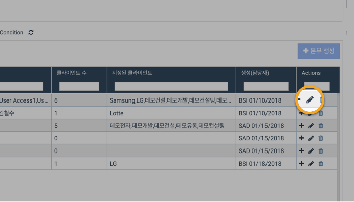

# 4. 본부\(Group\) 등록/수정/삭제하기

* 처음 시작하는 경우, 법인 대표 계정 \(Root 계정\)을 사용하여 로그인한 사용자가 본부\(Group\)을 생성해야 합니다. 
* 기존 사용자의 경우, Super Admin 또는  Group Admin 권한을 가진 사용자가 본부\(Group\)를 생성할 수 있습니다. 

본부\(Group\)는 **Organization View의 설정\(Set Up\) 메뉴를 통해 생성**할 수 있습니다. 

## 본부\(Group\) 만들기

1. Organization Home 화면의 왼쪽 메뉴 목록에서 '설정\(Set Up\)'을 선택합니다.
2. '설정\(Set Up\)' 화면의 상단에서 '본부 목록\(Groups\)' 탭을 선택합니다.

3. 화면 우측 상단의 '본부 생성' 버튼을 클릭합니다.

4. 본부의 이름을 입력합니다.

5. '생성' 버튼을 누릅니다.

6. 화면 상단에 붉은색 로딩바가 나타납니다. 생성이 완료될 때까지 잠시 기다려 주십시오.  

## 본부\(Group\) 이름 수정하기

1. Organization Home 화면의 왼쪽 메뉴 목록에서 '설정\(Set Up\)'을 선택합니다.
2. '설정\(Set Up\)' 화면의 상단에서 '본부\(Group\)' 탭을 선택합니다. 
3. 해당 본부 목록 오른쪽 끝에서 연필모양 버튼을 누릅니다. 
4. 본부의 이름을 수정합니다.
5. '업데이트'버튼을 눌러 수정합니다.  

## 본부\(Group\)삭제하기

1. Organization Home 화면의 왼쪽 메뉴 목록에서 '설정\(Set Up\)'을 선택합니다.
2. '설정\(Set Up\)' 화면의 상단에서 '본부\(Group\)' 탭을 선택합니다. 
3. 해당 본부 목록 오른쪽 끝에서 휴지통 모양 버튼을 누릅니다. 
4. '선택된 본부를 정말로 삭제하시겠습니까?' 팝업창에서 '확인'버튼을 눌러 삭제합니다.

