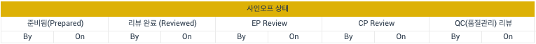
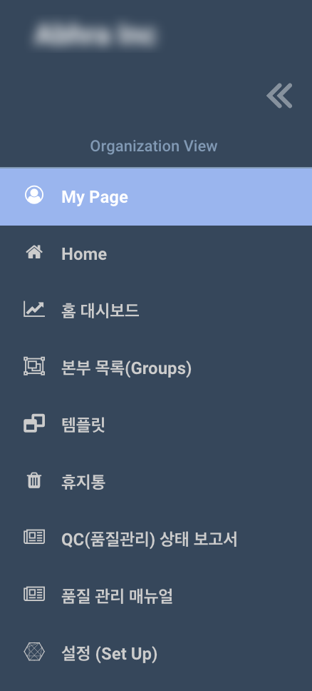
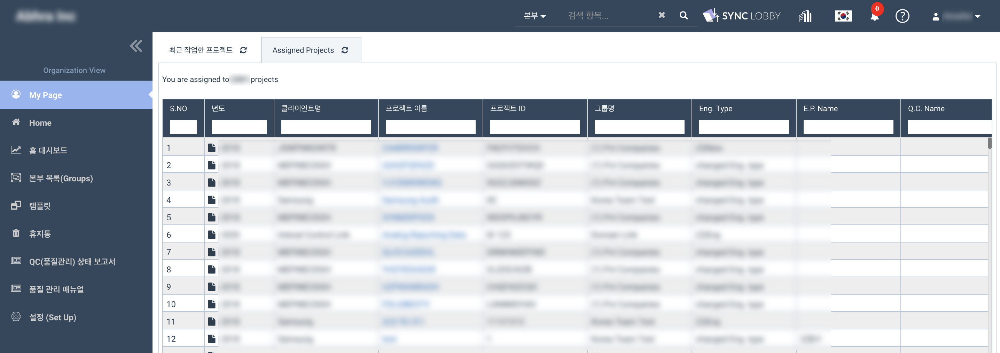
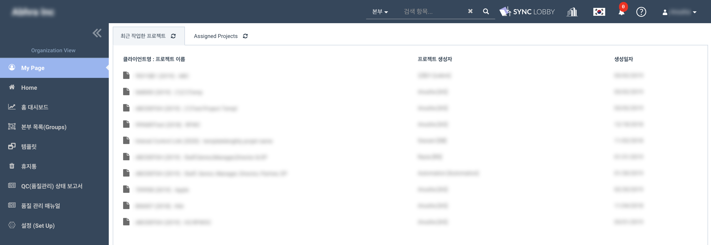

# 2019년 3월 업데이트 안내

## 주요 업데이트 내용 

1. 감사조서 및 영구감사조서 **사인오프\(Sign Off\) 화면 표기 항목이 축소**되었습니다. 

   > 기존 방식: Staff / Senior / Manager / Director / Partner / EP / CP / QC
   >
   > 변경된 방식: Prepare / Review / EP / CP / QC

2. 감사조서 및 영구감사조서 **사인오프\(Sign Off\) 체계**가 **변경**되었습니다.  
3. **My Page - Assigned Projects 메뉴가 추가**되었습니다. 

   > * 'Recently visited projects'가 My Page의 하위 항목으로 옮겨졌습니다.
   > * My Page 메뉴의 두번째 탭에서 자신이 배정된 프로젝트 목록 \(Assigned Projects\) 을 확인할 수 있습니다.

4. **코멘트 목록을 다운로드** 할 수 있습니다. 

## 목차

1. 사인오프 화면 표기 방식 변경 사항  
2. 사인오프 체계 변경 사항  
3. 사인오프를 다시 해야하는 경우 \(Re-sign off\)  
4. 직무 \(Role\) 수정 관련 변경 사항 
5. QC 관련 변경 사항 
6. 우클릭 메뉴 변경 사항    
7. 기존 프로젝트에 미치는 영향  
8. 마이 페이지 - 배정된 프로젝트 Assigned Projects 메뉴 추가  
9. 코멘트 목록 다운로드 안내 
10. 온라인 에디터 기능 확장 안내  
11. 템플릿 메뉴에 다중 파일 업로드 기능 추가   
12. 주의사항  
13. 아카이브 조건 설정 화면 추가
14. 기타 

 

## 1. 사인오프 화면 표기 방식 변경 사항   

### 1-1. 사인오프 대상 변경  

> * 기존 방식: Staff / Senior / Manager / Partner / Director / Engagement  Partner / Concurring Partner / Quality Control  모두 별도 사인오프 표기

**변경내용**: Prepare / Review / EP Review / CP Review / QC Review 로 항목 축소  

다양한 직무의 사인오프를 각각 표기하던 방식이 크게 Prepare / Review 로 통합되었습니다. EP, CP, QC 사인오프는 별도로 표기됩니다. 

### 1-2. 사인오프 표기 방식 변경 

> * 기존 방식: 사인오프 이후의 감사조서 수정,  다른 사용자가 다시 서명한 경우 \(re-sign off\) 등이 표시되지 않음

**변경내용:** 사인오프 이후 감사조서가 수정되거나, 다른 사용자가 다시 서명한 경우 \(re-sign off\) 화면에 표시됨 

| 감사조서 내용이 수정된 경우  | 다른 사용자가 다시 서명\(sign off\)한 경우 |
| :--- | :--- |
| 붉은색 \* 표시가 서명\(sign off\)에 나타납니다.  | 서명\(sign off\)가 붉은색으로 변경됩니다.  |

#### 1-2-1. 기본 사인오프 표기 

#### 1-2-2. 사인오프 이후 감사조서가 수정된 경우 

> 감사조서에 sign off 가 진행된 상황에서  감사조서를 수정할 경우, 이미 sign off를 진행한 사용자의 재승인\(re-sign off\)이 필요할 수 있으며, 이에 대한 경고창이 나타납니다.

#### 1-2-3. 사인오프 이후 다른 사용자가 해당 감사조서에 다시 서명\(sign off\)한 경우 

#### 1-2-4. 사인오프 이후 감사조서가 수정되고, 동시에 다른 사용자가 해당 감사조서에 다시 서명\(sign off\)한 경우 

### 1-3. 사인오프 표기 양식  

#### 1-3-1. 감사 프로젝트 내 직무 표기  

| 직무\(Role\) | 약자표기   |
| :--- | :--- |
| Staff | S |
| Senior | SS |
| Manager | M |
| Partner | P |
| Director | D |
| Engagement Partner | EP |
| Concurring Partner | CP |
| Quality Control | QC |

#### 1-3-2. 사인오프 표기 양식 

**\(직무 약자\) 담당자아이디 MM/DD/YY** 로 표기됩니다. 

> 2019년 02월 19일에 Staff인 김철수\(cskim\)이 사인오프 한 경우
>
> **예시: \(S\) cskim 02/19/19**
>
> 2019년 02월 20일에 Senior인 김영희\(yhkim\)가 사인오프 한 경우
>
> **예시: \(SS\) yhkim 02/20/19**

## 2. 사인오프\(sign off\) 체계 변경

### 2-1. 프로젝트에 배정된 모든 팀원이 감사조서를 Prepare 할 수 있습니다.    

Prepare는 일반적으로 감사조서 작성작가 작성을 완료한 후 표시하는 사인오프를 말합니다. 

> 주의:  QC 및 Client User \(외부 사용자\)는 감사조서를 Prepare 할 수 없습니다.

* 프로젝트 팀원 \(Staff, Senior, Manager, Partner, Director\)이 Prepare 버튼을 누른 경우

  > 해당 팀원의 사인오프가 Prepare 항목에 표시됩니다.

* 인게이지먼트 파트너 \(Engagment Partner\)가 Prepare 버튼을 누른 경우 

  > Engagement Partner의 사인오프가 Prepare 항목에 표시됩니다.

* 컨커링  파트너 \(Concurring Partner\)가 Prepare 버튼을 누른 경우  

  > Concurring Partner의 사인오프가 Prepare 항목에 표시됩니다.

* 품질관리자 \(Quality Control\)가 Prepare 버튼을 누른 경우  

  > QC는 감사조서를 Prepare 할 수 없습니다.

### 2-2. 프로젝트에 배정된 모든 팀원이 감사조서를 Review 할 수 있습니다.  

Review 는 일반적으로 작성 완료된 감사조서가 확인 절차를 거쳤음을 표시하는 사인오프를 말합니다. 

> 주의: Client Uesr \(외부 사용자\)는 감사조서를 Review 할 수 없습니다.

* **프로젝트 팀원** \(Staff, Senior, Manager, Partner, Director\)이 Review 버튼을 누른 경우 

  > 리뷰 항목에 해당 팀원의 사인오프가 표시됩니다.

* **인게이지먼트 파트너** \(Engagement Partner\)가 Review 버튼을 누른 경우 

  > 리뷰 항목과 EP Review 항목에 사인오프가 동시에 표시됩니다.

* **컨커링 파트너** \(Concurring Partner\)가 Review 버튼을 누른 경우  

  > 리뷰 항목과 CP Review 항목에 사인오프가 동시에 표시됩니다.

* **품질관리자** \(Quality Control\)가 Review 버튼을 누른 경우  

  > QC Review 항목에만 사인오프가 표시됩니다.

## 3.  사인오프를 다시 해야 하는 경우 \(Re-sign off\) 

> 감사조서에 이미 사인오프\(sign off\) 한 경우에도 다음 상황에서는 사인오프를 다시 진행\(re-sign off\) 해야 할 수 있습니다.  
>
> \*차기 업데이트에서 아카이브 조건을 법인과 계약유형에 맞게 설정할 수 있도록 개선될 예정입니다.

3-1. 붉은색 \(\*\) 표시가 Sign off 에 추가된 경우 사인오프를 다시 진행해야 합니다. \(Re-sign off가 필요합니다.\)  

> 언제 이런 표시가 나타나나요? 
>
> **사인오프 이후 해당 감사조서의 내용이 수정된 경우에 나타납니다.** 
>
> * Sign off 이후 해당 감사조서가 온라인 에디터에서 import 기능을 통해 교체 \(replace\)된 경우  
> * Sign off 이후 해당 감사조서가 우클릭 메뉴를 통해 교체\(replace\)된 경우 
> * Sign off 이후 해당 감사조서가 온라인 에디터를 통해 수정된 경우 
> * Sign off 이후 해당 감사조서가 싱크로비를 통해 수정된 경우

3-2. Sign off 표시가 붉은색으로 변경된 경우 사인오프를 다시 진행해야 합니다. \(Re-sign off 가  필요합니다.\) 

> 언제 이런 표시가 나타나나요? 
>
> **사인오프 이후 해당 감사조서의 사인오프가 다른 사용자에 의해  수정된 경우 나타납니다.** 
>
> * Sign off 이후 다른 사용자가 해당 감사조서를 prepare 또는 un-prepare 한 경우 
>
>   > review, EP review, CP review 항목의 sign off 가 붉은색으로 변경됩니다.
>
> * Sign off 이후 다른 사용자가 해당 감사조서를 review 또는 un-review 한 경우 
>
>   > EP review, CP review 항목의 sign off 가 붉은색으로 변경됩니다.  
>   >
>   > * EP가 해당 감사조서를 re-prepare 또는 re-review 한 경우, 일반 review 항목의 sign off는 영향을 받지 않습니다. 
>   > * CP가  해당 감사조서를 re-prepare 또는 re-review 한 경우, 일반 review 항목의 sign off는 영향을 받지 않습니다.
>
> *  Sign off 이후 다른 사용자가 해당 감사조서를 re-prepare 또는 re-review 한 경우 
>
>   > QC 항목의 sign off  표시가 붉은색으로 변경됩니다.

3-3. Prepare 사인오프를 다시 진행해야 하는 상황일 때, prepare 버튼이 활성화 됩니다. 이 때 prepare 버튼을 누르면 re-prepare가 진행됩니다. 

> * Prepare 사인오프가 다시 필요하지 않은 상황인 경우, prepare 버튼은 비활성화 됩니다. 
> *  Prepare 사인오프가 필요한 상황일 때 un-prepare 버튼은 비활성화 됩니다.

3-4. Re-review 가 필요한 상황일 때, re-review를 위해 review 버튼이 활성화 됩니다. 이 때 review 버튼을 누르면 re-review가 진행됩니다. 

> * Review 사인오프가 다시 필요하지 않은 상황인 경우, review 버튼은 비활성화 됩니다. 
> * Review 사인오프가 다시 필요한 상황일 때 un-review 버튼은 비활성화 됩니다.

3-5. QC 가 사인오프\(sign off\)한 감사조서는 기존에 사인오프 하지 않았던 사용자가 사인오프 할 수 없습니다.  

> * QC가 사인오프 하기 전 감사조서에 사인오프 했던 사용자는 다시 사인오프\(re-sign off: re-prepare 또는 re-review\) 할 수 있습니다.  
> * QC가 사인오프 하기 전 감사조서에 사인오프 했던 사용자는 사인오프를 취소 \(un-sign off: un-prepare 또는 un-review\) 할 수 없습니다.

## 4. 직무 \(Role\) 수정 관련 변경 사항  

### 4-1. 직무 분류 

* Staff, Senior, Manager, Partner, Director 를 유사 직무로 분류합니다. 
* EP, CP, QC, Client Access 는 별도의 분리된 직무로 분류합니다. 

### 4-2. 직무 변경 

* Staff, Senior, Manager, Partner, Director, Partner, Engagement Partner, Concurring Partner  는 기존 사인오프 여부와 상관없이 직무를 변경할 수 있습니다.  
* 사용자의 직무\(Role\)가 변경되면 해당 사용자의 모든 사인오프 역시 함께 새로운 직무의 사인오프로 수정됩니다. 

  > * 사용자가 사인오프를 이미 한 경우 Quality Control로 직무를 변경할 수 없습니다. Quality Control로 직무를 변경하기 위해서는 기존의 사인오프를 모두 취소 \(un-prepare / un-review\) 해야 합니다. 
  > * 법인 내부에 소속된 사용자는 Client Access 로 변경할 수 없습니다.

### 4-3. 직무 변경이 불가능한 상황   

* 사용자가 Client Access로 프로젝트에 배정된 경우 직무를 변경할 수 없습니다.  

  > 이 경우 사용자를 프로젝트에서 직무 해제 \(Un-assign\) 한 후 다시 배정해야 합니다.

* QC로 프로젝트에 배정된 사용자가 이미 감사조서에 Sign Off 한 경우 직무를 변경할 수 없습니다. 

  > 이미 감사조서를 사인오프 한 QC 사용자를 다른 직무로 변경해야 하는 경우, 해당 사용자의 모든 Sign off를 취소 \(un-review\) 해야 합니다.

* EP 또는 CP 사용자가  re-review 해야하는 sign off 가 있는 경우 직무를 변경할 수 없습니다.  

  > re-review 가 필요한 서명을 모두 re-review 처리해야 직무를 변경할 수 있습니다.

* Staff, Senior, Manager, Partner, Director 사용자가 re-review 해야하는 sign off가 있는 경우 EP 또는 CP로 직무를 변경할 수 없습니다.  

  > re-review 가 필요한 서명을 모두 re-review 처리해야 직무를 변경할 수 있습니다.

### 4-4. 직무 변경에 따라 사인오프를 다시 해야 하는 경우 

* EP가 Staff, Senior, Manager, Partner, Director 로 변경된 경우

  > 다른 EP 또는 CP 사용자가 감사조서에 다시 사인오프 \(Re-sign off\) 해야 합니다.

* EP 또는 CP 사용자가 변경된 경우

  > 다른  CP 사용자가 감사조서에 다시 사인오프 \(Re-sign off\) 해야 합니다.

* Staff, Senior, Manager, Partner, Director, EP, CP가  변경된 경우

  > EP 와 CP가 감사조서에 다시 사인오프 \(Re-sign off\) 해야 합니다.

## 5. QC 관련 변경 사항  

1. QC는 감사조서의 QC 지정 여부에 상관없이 모든 review된 감사조서에 사인오프\(sign off\)  할 수 있습니다.  

   > 기존 방식: QC는 QC에게 지정된 감사조서만 사인오프 할 수 있었습니다.

2. QC가  QC에게 지정되지 않은 감사조서를 sign off하면 해당감사조서는 자동으로 QC에게 지정된 감사조서로 설정됩니다.  
3. QC가 sign off 한 감사조서를 기존에 사인오프 하지 않았던 다른 사용자가 prepare / un-prepare / review / un-review 할 수 없습니다.  

   > * QC는 작성자 및 리뷰어의 사인오프가 존재하는 감사조서만 사인오프 할 수 있습니다. 
   > * 따라서 QC가 사인오프한 감사조서에는 기본적으로 팀원의 prepare / review 사인오프가 존재합니다. 
   > * '기존에  사인오프 하지 않았던 다른 사용자' 란 QC의 사인오프 이전에 문서 작성자 또는 리뷰어로써 사인오프 하지 않았던 사용자를 의미합니다.

4. QC가 sign off 하기 전 해당 감사조서에 사인오프 \(sign off\)했던 사용자의 경우 해당 사인오프\(sign off\)을 re-prepare / re-review 할 수 있습니다. 
5. QC가 sign off 한 감사조서를 다른 사용자가 교체\(replace\)하거나 수정할 수 있습니다. 이 경우 re-prepare와 re-review 버튼이 활성화됩니다. 

## 6. 당기감사조서 우클릭 메뉴 변경 사항  

1. Edit Description: 감사조서 참조번호 및 제목 변경 
2. Prepare / Review: 우클릭 메뉴를 통해 감사조서를 sign off 할 수 있습니다.  
3. Replace \(파일 바꾸기\): 온라인 상에서 수정하거나 다운로드 할 수 있는 감사조서인 경우 해당 감사조서를 다른 파일로 교체\(Replace\) 할 수 있습니다. 
4. 제약사항  
   * un-prepare / un-review는 우클릭 메뉴에서 이용할 수 없습니다. 
   * 감사조서를 온라인 에디터 또는 싱크로비에서 이용중인 경우 다른 파일로 교체\(replace\) 할 수 없습니다.  
   * 파일 바꾸기 \(replace\)는 동일한 형식의 파일로만 가능합니다.  \(예: .xlsx 와 .xls 파일을 서로 대체할 수 없습니다.\) 
5. 주의사항  
   * 온라인 에디터에서 import 기능을 사용하여 불러온 .xls, .doc 파일은 자동으로 .xlsx, .docx 로 변경됩니다.
   * 첨부파일 업로드\(Upload file\), 감사 프로그램, Flux Analytics, Final Analytics 메뉴에서는 파일 바꾸기 \(replace\) 기능을 사용할  수 없습니다.  

## 7. 기존 프로젝트에 미치는 영향   

1. 기존 프로젝트에 진행된 sign off는 prepare, review 항목에 동시에 표기됩니다. 
   1. EP의 sign off는 EP review 항목에 함께 표기됩니다. 
   2. CP의 sign off는 CP review 항목에 함께 표기됩니다. 
   3. QC sign off는 QC항목에 표기됩니다. 
2. 모든 코멘트, 감사프로그램 sign off의 표기 앞에 직무\(Role\) 가 약자로 추가됩니다. 
3. 이미 아카이브 된 프로젝트에는 영향이 없습니다. \(아카이브를 해제하는 경우 영향을 받을 수 있습니다.\)    

## 8.  마이 페이지 - 배정된 프로젝트 Assigned Projects 메뉴 추가

### 8-1. My Page 메뉴 추가 

'최근 방문한 프로젝트', '내가 배정된 프로젝트'를 확인할 수 있는 'My Page' 메뉴가 추가되었습니다.   

### 8-2. Assigned Projects 메뉴  추가  

* My Page 메뉴의  'Assigned Projects' 탭에서  나에게 배정된  프로젝트를 확인할 수 있습니다. 
* 프로젝트 제목을 누르면 해당 프로젝트의 화면으로 이동합니다. 

### 8-3. Recently visited projects 가 My Page 하위로 이동   

'최근 방문한 프로젝트\(Assigned Projects\)'  메뉴가 My Page의 안으로 이동되었습니다. 

## 9. 코멘트 목록 다운로드 안내  

개별 프로젝트 화면의 감사조서 '코멘트 목록' 에서 코멘트 목록을 다운로드 할 수 있습니다.  

> 또는 '내 컴퓨터'의 '다운로드' 항목에서도 코멘트 목록 파일을 찾을 수 있습니다.

## 10. 온라인 에디터 기능 확장 안내 

1. .xls, .doc 형식 파일을 사용할 수 있습니다. 

   > 다음 메뉴에서 .xls, .doc 파일을 온라인 에디터를 통해 사용할 수 있습니다. 
   >
   > * QC Manual
   > * Templates \(Upload file 기능 포함\) 
   > * Workpapers \(Upload file 기능 포함\)
   > * Permanent File \(Upload file 기능 포함\)  
   > * PBC

2. 당기감사조서 메뉴에서 .xls, .doc 파일을 싱크로비를 통해 열 수 있습니다. 
3. 온라인 에디터에서 엑셀 파일을 편집 중인 경우 .xls, .xlsx 파일을 import 할 수 있습니다.
4. 온라인 에디터에서 워드 파일을 편집  중인 경우 .doc, .docx 파일을 import 할 수 있습니다. 
5. .xls, .docx 파일은 롤 포워드 시 .xlsx, .docx 로 변경됩니다.  

## 11. 템플릿 메뉴에 다중 파일 업로드 기능 추가  

1.  다양한 형식의 파일을 프로젝트 템플릿에 업로드 할 수 있습니다.  
2. 사용자가 다양한 형식의 파일이 포함된 템플릿을 이용하여 프로젝트를 생성한 경우 
   1. .xls, .xlsx, .doc, .docx, .pdf 파일을 온라인 에디터 또는 싱크로비로  열 수 있습니다.  
   2. 위 형식 외의 파일은 다운로드하여 이용할 수 있습니다.  
3. 템플릿을 이용해 프로젝트를 생성한 경우 .xls, doc 형식 파일을 온라인 에디터에서 사용할 수 있습니다.  
4. New File &gt; workpaper template 옵션을 통해  만든 .xls, .doc 파일을 온라인 에디터에서 사용할 수 있습니다.   

## 12. 주의사항   

1. 다중 Sign Off \(Power Sign Off\) 기능이 임시로 중지됩니다. 
2. Re-prepare / Re-review 필요여부를 감사조서 파일 화면을 새로고침하여 확인해야 합니다.

## 13. 아카이브 조건 설정 화면 추가  

아카이브 조건을 설정할 수 있는 화면이 추가되었습니다. 해당 화면은 법인 관리자 \(Super Admin\) 만 접근할 수 있으며, 실제 기능의 구현은 다음 업데이트에서 적용됩니다.  

> \(프로젝트 유형에 따라 아카이브 조건을 설정할 수 있는 기능을 준비중입니다.\)

현재 프로젝트를 아카이브 하기 위한 조건은 다음과 같습니다. 

* Re-prepare / Re-review 가 필요한 감사조서를 모두 재승인\(Re-sign off\)해야 합니다. 
* EP는 모든 감사조서 및 영구감사조서 파일에 서명\(sign off\) 해야 합니다.  

## 12. 기타 안내사항 

> 이하 내용은 다음 업데이트를 위해 단순히 화면 구성요소만 미리 추가되었습니다.  실제로 작동하지 않는 기능이오니 다음 업데이트를 기다려 주시면 감사하겠습니다.

* 다음 업데이트에 적용되는 내용 
  * Power Sign off 기능  
  * 홈대시보드 Export 기능
  * 아카이브 조건 설정 기능 

