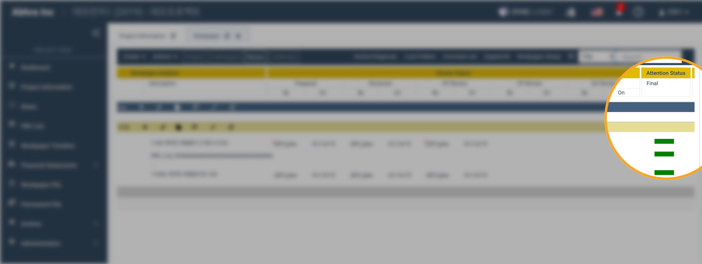
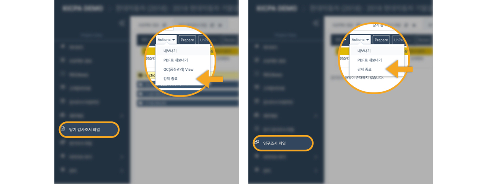

# 2019년 4월 2차 업데이트 안내


업데이트를 반영하기 위해 반드시 ctrl + shift + R 키를 함께 눌러 반드시 '**강력 새로고침**' 을 진행해주시기 바랍니다. 

맥 사용자는 command + shift + R 키를 함께 눌러 반드시 '**강력 새로고침**'을 진행해주시기 바랍니다. 


## 1. 감사조서 상태 항목이 Attention 으로 변경되었습니다. 

1. 감사조서 상태 표시 항목이 **Attention** 으로 이름이 변경되었습니다. 
2. Stage, Final 2 단계로 구분되던 것에서 Final 만 사용하도록 **1 단계로 축소**되었습니다. 
3. 조서 생성시 Attention **기본값은 완료** \(Completed, 초록색\) 입니다. \(직접 바꾸지 않는 이상 별도로 변경하지 않아도 됩니다. \)
4. 업데이트 이전 생성된 모든 **기존 조서의 Attention 상태가 완료\(초록색\) 상태로 변경**되었습니다. 
5. S키를 사용하여 스테이지 단계의 상태를 변경하던 기능은 더이상 동작하지 않습니다. 
6. F키를 사용하여 Attention 의 상태를 변경할 수 있습니다. 단, Attention 의 상태가 완료가 아닌 경우 가능합니다.  

## 2. 홈 대시보드와 QC상태 보고서에 프로젝트가 아카이브된 일자가 표시됩니다. 

1. 프로젝트가 아카이브 된 경우 아카이브 일자를 홈 대시보드 또는 QC 상태 보고서에서도 볼 수 있습니다. 
2. 프로젝트의 아카이브가 해제된 경우 가장 최근의 아카이브 일자가 홈 대시보드 또는 QC 상태 보고서에 나타납니다. 
3. QC 상태 보고서의 '진행중인 프로젝트' 부분에 아카이브 일자가 있는 프로젝트가 표시되는 경우, 아카이브가 해제\(unarchive\) 된 프로젝트입니다. \(아카이브가 끝난 프로젝트는 QC 상태 보고서의 '마무리된 프로젝트' 부분에 나타납니다.\) 

## 3. 아카이브 진행 시 간혹 발생하던 문제가 해결되었습니다. 

4월 업데이트 이후 제보되었던 아카이브 관련 문제가 해결되었습니다. 

더불어 아카이브 조건을 다시 한 번 안내드립니다. 

1. 이하 내용의 '감사조서'는 당기감사조서와 영구조서를 모두 포함합니다. 아카이브 전 당기감사조서와 영구조서 화면을 모두 확인하여 주십시오. 
2. 모든 감사조서에는 리뷰어의 리뷰 사인오프가 필요합니다. \(반드시 인게이지먼트 파트너의 리뷰일 필요는 없습니다. 팀원 중 한 사람의 리뷰이면 됩니다.\) 
3. 모든 감사조서의 사인오프에는 붉은색 \* 표시가 없어야 합니다. \(붉은색 \* 표시가 있는 사인오프는 해당 사인오프 이후 해당 조서가 수정되었음을 나타냅니다.\) 
4. 모든 감사조서의 사인오프는 붉은색이 아니어야 합니다. \(붉은색 사인오프는 다른 팀원의 사인오프가 수정되었고 이에대한 확인이 필요함을 나타냅니다.\) 
5. 품질관리자\(QC\)에게 지정된 조서는 반드시 품질관리자의 리뷰 사인오프를 받아야 합니다. \(품질관리자에게 지정된 조서는 조서번호 왼쪽에 초록색 동그라미가 표시됩니다.\) 
6. 모든 타임라인 항목이 삭제되어야 합니다. \(사용하신 적이 없는 분들은 확인하지 않으셔도 괜찮습니다.\) 
7. 모든 고객제공자료\(PBC\) 항목이 삭제되어야 합니다. \(사용하신 적이 없는 분들은 확인하지 않으셔도 괜찮습니다.\) 
8. 휴지통의 모든 파일이 삭제되어야 합니다. 
9. 모든 감사조서의 코멘트가 삭제되어야 합니다. 
10. 프로젝트 내의 모든 조서가 닫혀 있어야 합니다. \(팀원 간 저장되지 않고 열려있는 조서가 있는지 확인하여 주십시오. 확인을 마쳤는데도 아카이브 준비 진단에서 문서 닫기를 요청할 경우, 아래 화면을 참고하셔서 감사조서 화면의 '강제종료' 기능을 사용하여 프로젝트 내 모든 조서를 강제 종료하여 주십시오.\) 


업데이트를 반영하기 위해 반드시 ctrl + shift + R 키를 함께 눌러 반드시 '**강력 새로고침**' 을 진행해주시기 바랍니다. 

맥 사용자는 command + shift + R 키를 함께 눌러 반드시 '**강력 새로고침**'을 진행해주시기 바랍니다. 


