# 2019년 4월 업데이트 안내

## 2019년 4월 어딧로비 업데이트 요약보기

### 1. 법인 단계\(Organization Level\)에서의 사용자 관련 업데이트

1. 법인 내부 사용자와 외부 사용자가 분리되었습니다. 
2. 법인 전체의 아카이브를 관리하는 '아카이브 관리자' 권한이 생성되었습니다. 
3. 사용자가 어딧로비를 이용하는 것을 일시적으로 차단할 수 있습니다. 
4. 최고 관리자만이 법인 전체에 적용되는 사용자 정보를 수정할 수 있습니다.  
5. 사용자 정보에 타이틀 항목이 추가되었습니다.  

### 2. 프로젝트 단계\(Project Level\)에서의 사용자 관련 업데이트

1. 프로젝트 아카이브 권한을 설정할 수 있습니다.  
2. 사용자를 프로젝트 내부에서 일시적으로 비활성화 할 수 있습니다.
3. 사용자를 읽기 전용으로 설정할 수 있습니다. 
4. 프로젝트의 롤포워드 권한을 사용자에 따라 허용할 수 있습니다. 
5. 외부 사용자의 권한을 읽기 전용 또는 PBC 업로드로 설정할 수 있습니다.  
6. 외부 사용자의 사용 만료일을 설정할 수 있습니다. 

### 3. 아카이브, 사인오프 관련 업데이트

1. 아카이브 조건 및 진행상황을 확인할 수 있는 '아카이브 준비 진단' 메뉴가 추가되었습니다. 
2. 프로젝트 책임자\(Engagement Partner\)가 모든 감사조서에 리뷰 사인오프 하지 않아도 프로젝트를 아카이브 할 수 있습니다.  
3. 모든 문서가 닫혀 있어야 프로젝트를 아카이브 할 수 있습니다. 이를 위해 열려있는 문서에 대한 강제종료 기능이 추가되었습니다.  
4. 품질관리자\(QC\)가 이미 사인오프한 파일에도 다른 사용자가 사인오프 할 수 있습니다. 

### **4. 품질 관리\(QC\) 업무 관련 업데이트**

1. QC 코멘트를 사용할 수 있습니다.   
2. QC 코멘트 목록을 다운로드 할 수 있습니다.  
3. QC 상태 보고서를 다운로드 할 수 있습니다. 
4. 홈 대시보드를 다운로드 할 수 있습니다.

### 5. 감사조서 관련 업데이트

1. ​열려있는 모든 감사조서를 강제 종료 할 수 있습니다. 
2. 파일 업로드 용량 제한이 30MB로 상향 조정되었습니다.

   > * 기존 용량 제한 10MB
   > * 다중 파일 업로드 기능 사용시 한 번에 10개 파일을 올릴 수 있으며, 따라서  총 파일 업로드 용량은 1회당 300MB로 제한됩니다. \(30MB \* 10 = 300MB\)

3. 최대 30MB 까지 zip 파일을 '다중 파일 업로드' 또는 '끌어다 놓기' 방식으로 업로드 할 수 있습니다.
4. 단축키를 사용하여 감사조서를 사인오프 하거나 감사조서 상태\( 초록색 / 붉은색 \)를 완료로 변경할 수 있습니다.

## 업데이트 상세 안내

## 1. 법인 단계\(Organization Level\)에서의 사용자 관련 업데이트

1. 법인 내부 사용자\(Internal User\)와 외부 사용자\(External User\)가 분리되었습니다. 
2. '아카이브 관리자\(Archive Manager\)' 직무가 생성되었습니다. 
3. 사용자가 어딧로비를 이용하는 것을 일시적으로 차단\(Suspend\)할 수 있습니다. 
4. 최고 관리자\(Super Admin\)만이 법인 전체에 적용되는 사용자 정보를 수정할 수 있습니다.  
5. 사용자 정보에 Title 항목이 추가되었습니다.  

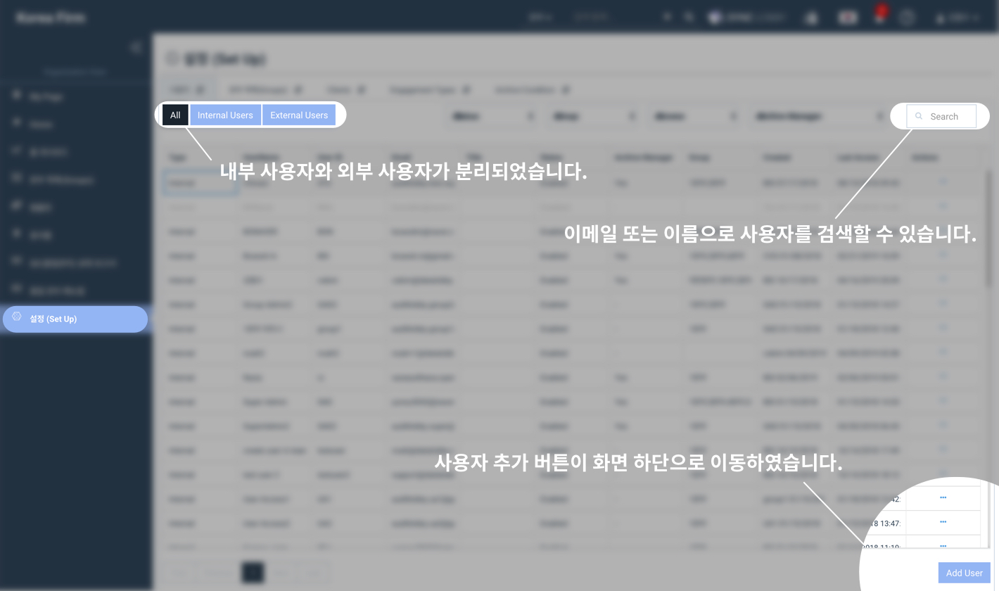

### **1-1. 법인 내부 사용자\(Internal User\)와 외부 사용자\(External User\)가 분리되었습니다.**

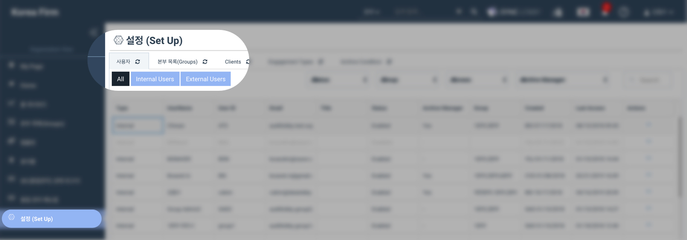

1. 법인 내부 사용자 \(Internal User\)

   > 법인에 소속된 모든 사용자 입니다. 기존 사용자는 모두 법인 내부 사용자로 전환되었습니다.

2. 법인 외부 사용자 \(External User\)

   > * 감리를 위한 읽기 전용 계정을 요청받을 경우 '외부 사용자\(External User\)'로 등록하여 권한을 제한할 수 있습니다. 
   > * 고객사에서 PBC 업로드 계정을 요청할 경우 '외부 사용자\(External User\)'로 등록하여 권한을 제한할 수 있습니다.

### **1-2. '아카이브 관리자\(Archive Manager\)' 직무가 생성되었습니다.**

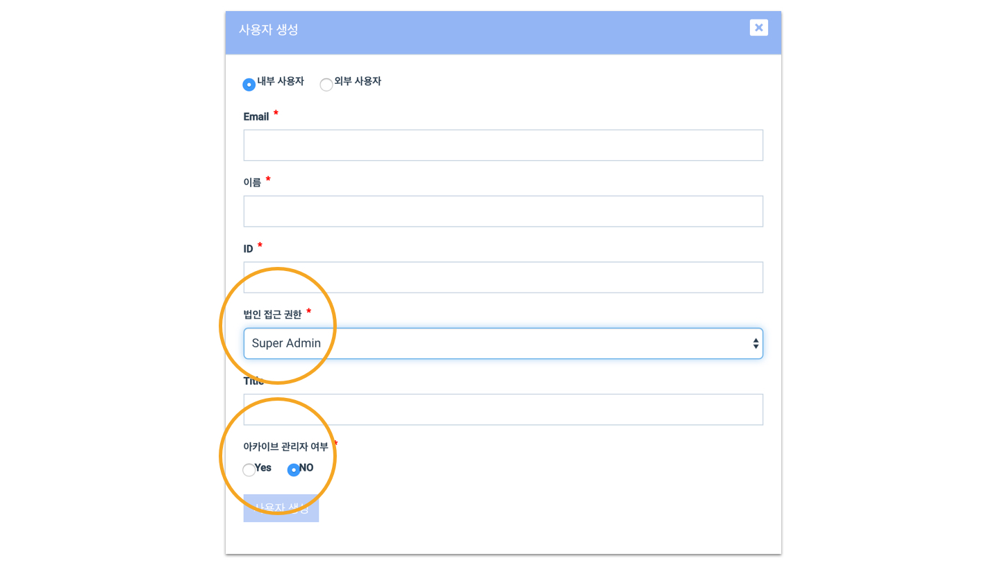

> * 기존 최고 관리자 \(Super Admin\) 전체에 '아카이브 관리자' 권한이 추가되었습니다. \(설정화면에서 수정하실 수 있습니다.\) 
> * 아카이브 관리자는 아카이브 조건을 설정하거나 아카이브 된 프로젝트를 관리할 수 있습니다. 
> * 아카이브 된 프로젝트의 별도 관리 기능이 5월 업데이트에 추가될 예정입니다.

### 1-3. 사용자의 프로그램 접근을 일시적으로 차단\(Suspend\) 처리 할 수 있습니다.

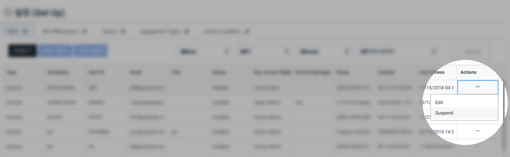

1. 회계법인용 화면 &gt; 설정 &gt; 사용자 에서 해당 사용자를 이용 중지\(Suspend\) 처리할 수 있습니다.

   > * Suspend 처리된 사용자는 어딧로비에 로그인 할 수 없습니다. 
   > * Suspend 된 사용자의 정보는 그대로 어딧로비 내부에 보존됩니다. 
   > * Suspend 처리된 사용자는 배정된 모든 프로젝트에서 비활성화\(Deactivate\) 처리됩니다.  
   > * Suspend 처리된 사용자를 다시 복구\(Restore\) 하거나 삭제\(Remove\) 할 수 있습니다. 
   > * Susepnd 처리된 사용자를 다시 복구하더라도 개별 프로젝트 내부에서는 비활성화 처리된 상태로 남아있습니다.  
   > * 최고 관리자 \(Super Admin\) 만이 다른 사용자를 Suspend 처리 할 수 있습니다.

### 1-4. 최고 관리자만이 법인 전체에 적용되는 사용자 정보를 수정할 수 있습니다.

최고 관리자 \(Super Admin\) 만이 법인 메뉴의 설정 &gt; 사용자 에서 사용자를 추가 / 차단 / 복구 / 삭제 / 수정 할 수 있습니다.

### 1-5. 사용자 정보에 'Title'이 추가되었습니다.

1. 타이틀은 추가 정보란으로, 실제 업무나 권한에 영향이 없습니다. 
2. 내부 사용자의 타이틀: 선택사항입니다. 내부 사용자의 추가 정보를 입력하는데 사용됩니다. 
3. 외부 사용자의 타이틀: 필수사항입니다. 외부 사용자의 등록 목적 등을 입력하는데 사용됩니다. 

## 2. 프로젝트 단계\(Project Level\)에서의 사용자 관련 업데이트

1. 프로젝트 아카이브 권한을 설정할 수 있습니다.  
2. 사용자를 프로젝트 내부에서 일시적으로 비활성화\(Deactivate\)할 수 있습니다.
3. 사용자를 Read Only \(읽기 전용\) 으로 설정할 수 있습니다. 
4. 프로젝트의 Roll-Forward 권한을 사용자에 따라 허용할 수 있습니다. 
5. 외부 사용자를 Read Only 또는 PBC Uploader 로 설정할 수 있습니다.  
6. 외부 사용자의 사용 만료일\(Expiry date\)을 설정할 수 있습니다. 

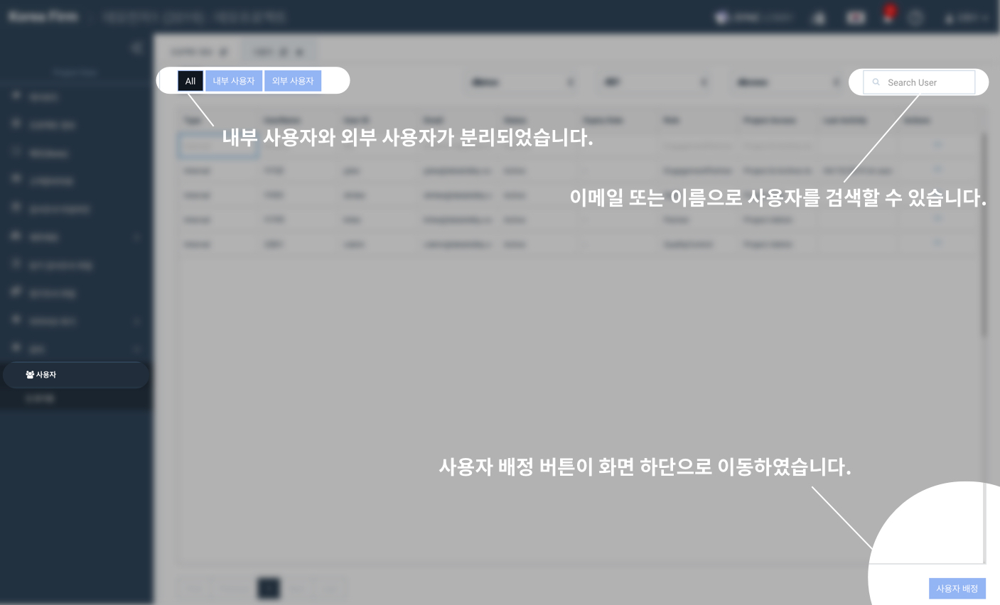

### 2-1. 프로젝트 아카이브 권한을 설정할 수 있습니다.

1. Project & Archive Admin 을 선택하면 해당 사용자는 프로젝트 관리자의 권한을 가지며, 프로젝트를 아카이브 할 수 있습니다. 
2. Project Admin 을 선택하면 해당 사용자는 프로젝트 관리자의 권한을 가집니다. 
3. Project User 를 선택하면 해당 사용자는 일반 팀원의 권한을 가집니다. 
4. 기존 프로젝트 책임자 \(인게이지먼트 파트너\)는 모두 Project & Archive Admin 의 권한을 가지게 됩니다.  

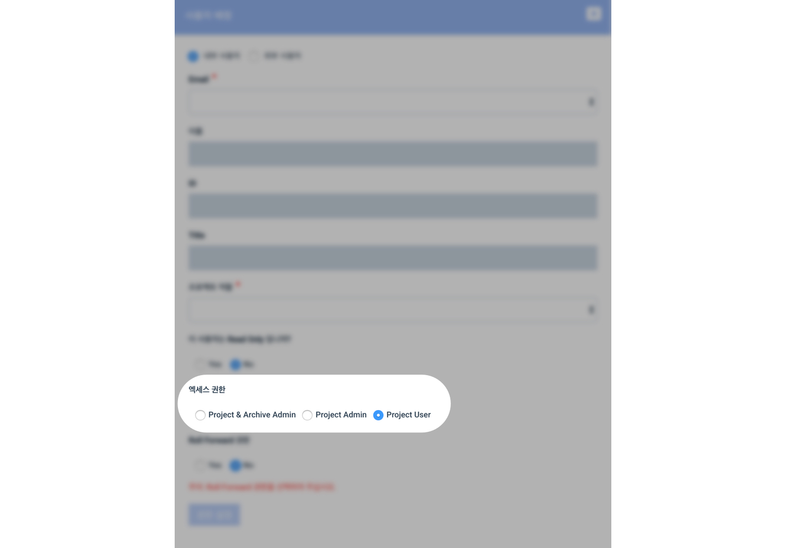

### 2-2. 사용자의 프로그램 내 특정 프로젝트 접근을 일시적으로 비활성화\(Deactivate\) 할 수 있습니다.

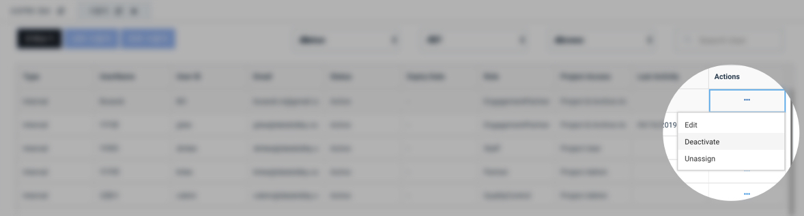

1. 사용자의 프로그램 내 프로젝트 접근을 일시적으로 비활성화 \(Deactivate\)할 수 있습니다.

   > * 프로젝트 화면 &gt; 설정 &gt; 사용자 에서 해당 사용자를 비활성화 \(Deactivate\) 할 수 있습니다. 
   > * 비활성화된 사용자는 해당 프로젝트를 열 수 없습니다. 
   > * 비활성화된 사용자는 다시 활성화\(Activate\) 할 수 있습니다.

### 2-3. 사용자를 Read Only \(읽기 전용\)으로 설정할 수 있습니다.

1. Read Only 항목이 Yes 로 설정된 사용자는 프로젝트 안에서 파일을 수정하거나 삭제할 수 없습니다. 
2. Read Only 항목이 Yes 로 설정된 사용자는 프로젝트를 잠그거나, 아카이브할 수 없습니다. 
3. 프로젝트에 참여하는 사용자는 Read Only 항목을 no로 설정하여 생성, 수정 등이 가능하도록 합니다. \(Read Only No = Editable\) 

> 주의사항
>
> 기본값이 Read Only = No 로 지정되어 있습니다. 파일을 편집할 수 없도록 제한해야 하는 사용자만 Read only 를 Yes 로 설정해주시면 됩니다.

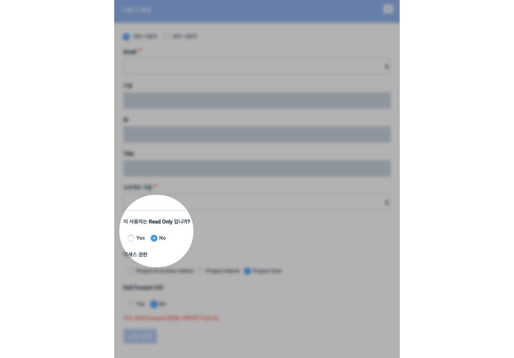

### 2-4. 개별 프로젝트의 Roll-Forward 권한을 사용자에 따라 허용할 수 있습니다.

1. 해당 프로젝트를 Roll-Forward 할 수 있는 권한을 사용자에 따라 설정할 수 있습니다.  
2. Roll-Forward 가 허용된 사용자는 신규 프로젝트 생성시 해당 프로젝트를 Roll-Forward 목록에서 볼 수 있습니다. 
3. 법인 최고 관리자\(Super Admin\)은 이 권한에 영향을 받지 않으며, 스스로를 해당 프로젝트에 배정하여 권한을 허용할 수도 있습니다.  
4. 법인 단계에서의 권한이 User Access 인 경우 프로젝트 생성이 불가능하며, 이에 따라 Roll-Forward의 허용은 User Access 사용자에게 영향이 없습니다.  

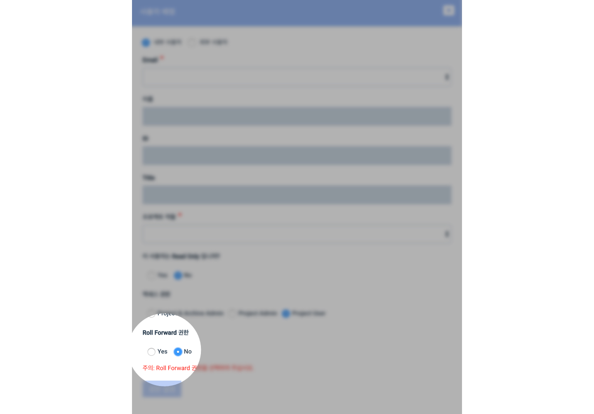

### 2-5. 외부 사용자를 Read Only 또는 PBC Uploader 로 설정할 수 있습니다.

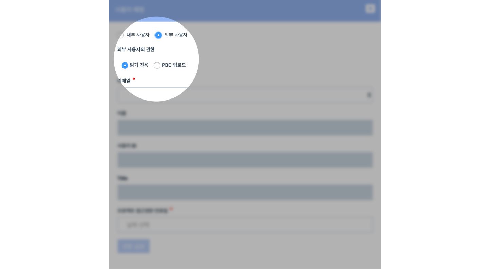

1. 외부 사용자가 읽기 전용\(Read Only\) 으로 설정되면 프로젝트 내부의 파일을 수정, 삭제, 사인오프 할 수 없습니다. 
2. 외부 사용자가 PBC 업로드로 설정되면 해당 사용자는 PBC 메뉴만 사용할 수 있고, 다른 메뉴는 화면에서 숨겨집니다. 

### 2-6. 외부 사용자의 사용 만료일\(Expiry date\)을 설정할 수 있습니다.

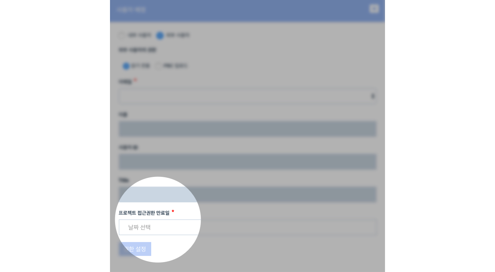

1. 설정된 만료일이 지나면 외부 사용자는 해당 프로젝트에 접근할 수 없습니다. 
2. 만료일을 수정하면 외부 사용자는 다시 해당 프로젝트에 접근할 수 있습니다. 

## 3. 아카이브, 사인오프 관련 업데이트

1. 아카이브 준비 진단\(Archive Diagnosis\) 메뉴가 추가되었습니다. 
2. 프로젝트 책임자\(Engagement Partner\)의 Review가 아카이브 필수 조건에서 선택 조건으로  변경되었습니다. 
3. 품질관리자 \(QC\)가 이미 사인오프한 파일에도 다른 사용자가 사인오프 할 수 있습니다. 

### **3-1. 아카이브 준비 진단 \(Archive Diagnosis\) 화면**

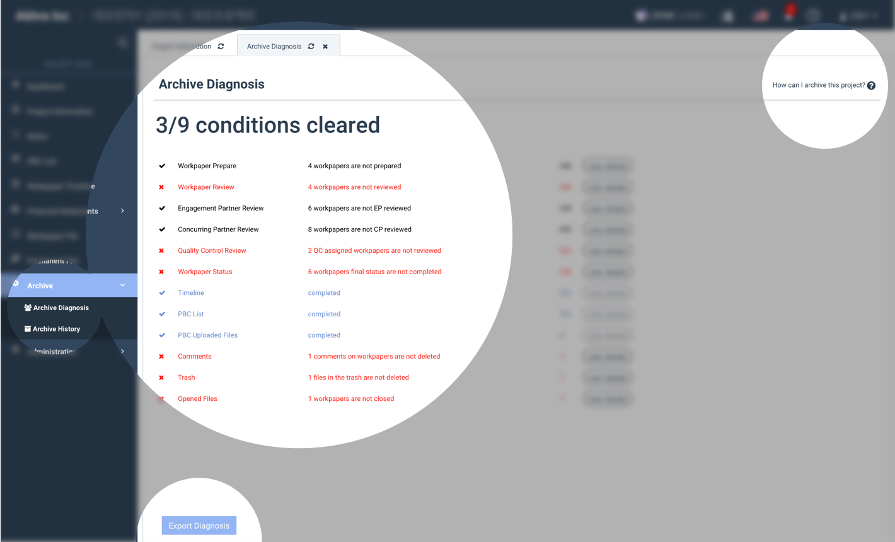

1. 아카이브 준비 진단 \(Archive Diagnosis\) 화면에서 아카이브를 위해 필요한 조건과 완료 여부를 알 수 있습니다. 
2. 이 화면은 화면 좌측 아카이브 메뉴 또는 당기감사조서 화면의  '아카이브 준비 진단' 버튼을 눌러 이용하실 수 있습니다.  
3. 모든 조건이 완료되면 화면 하단의 'Export Diagnosis' 버튼 옆에 '아카이브' 버튼이 나타납니다. 
4. 'View Detail' 을 누르면 아카이브를 위해 진행해야 하는 조건의 상세 내용을 보실 수 있습니다. 

### 3-2. 아카이브 버튼의 위치가 옮겨졌습니다. 아카이브 버튼은 '아카이브 준비 조건'을 모두 충족하시면 '아카이브 준비 진단' 화면의 하단에 나타납니다

### 3-3. 프로젝트 책임자\(Engagement Partner\)의 Review가 아카이브 필수 조건에서 선택 조건으로  변경되었습니다.

프로젝트 책임자\(인게이지먼트 파트너, Engagement Partner, EP\)가 모든 감사조서를 리뷰 사인오프 하지 않아도 프로젝트를 아카이브 할 수 있습니다.

### 3-3. 모든 조서가 닫혀 있어야 프로젝트를 아카이브 할 수 있습니다. 이를 위해 열려있는 문서에 대한 강제종료 기능이 추가되었습니다.

프로젝트 내부의 모든 조서\(당기감사조서 및 영구조서\) 파일이 닫혀 있어야 프로젝트를 아카이브 할 수 있습니다. 프로젝트 내 열려있는 조서의 목록을 확인하는 기능은 5월 업데이트에 반영될 예정입니다.

위 조건을 위해 프로젝트 내 열려있는 감사조서를 모두 닫는 강제종료\(Force Close\) 기능이 추가되었습니다. 당기감사조서 파일 화면과 영구조서 파일 화면에서 Action 버튼을 누르신 후, '강제 종료'를 누릅니다.

프로젝트 내에 열려있는 당기감사조서, 영구조서가 각각 모두 닫히게 되며 이 때 저장되지 않은 내용은 손실될 수 있습니다.

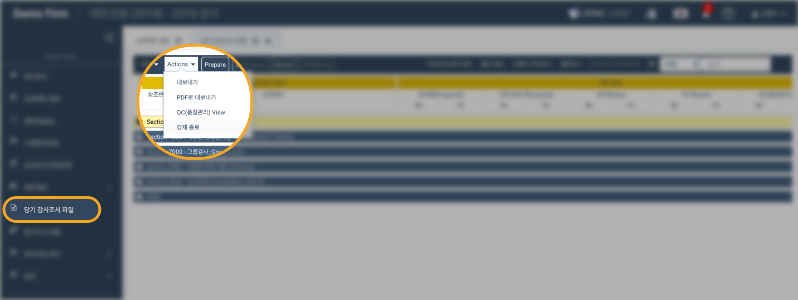

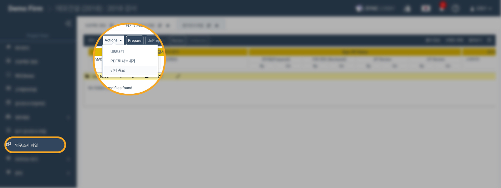

> 주의사항
>
> 프로젝트 안에 최소 하나의 프로젝트 책임자 리뷰가 존재해야 합니다.

### 3-4. 품질관리자가 이미 사인오프 한 파일에도 다른 사용자가 사인오프 할 수 있습니다.

1. 품질관리자가 이미 리뷰\(Review\) 사인오프한 파일에도  다른 사용자가 프리페어\(Prepare\), 리뷰\(Review\), 프리페어 취소\(Un-prepare\), 리뷰 취소\(Un-review\)를 할 수 있습니다. 
2. 품질관리자가 이미 리뷰\(Review\) 사인오프한 파일의 내용을 수정할 수 있습니다. 
3. 품질관리자가 이미 리뷰\(Review\) 사인오프한 파일을 삭제할 수 있습니다. 

> 주의사항
>
> 품질관리자가 이미 리뷰 사인오프한 파일을 다른 사용자가 수정하거나 사인오프를 변경한 경우, 품질관리자에게 다시 리뷰 사인오프를 받아야 합니다.

## 4. 품질 관리\(QC\) 업무 관련 업데이트

1. QC Comment 를 사용할 수 있습니다.
2. QC Comment 를 다운로드 할 수 있습니다.  
3. QC Status Report 를 다운로드 할 수 있습니다. 
4. 홈 대시보드\(Home Dashboard\) 를 다운로드 할 수 있습니다.

### 4-1. QC comment 를 사용할 수 있습니다.

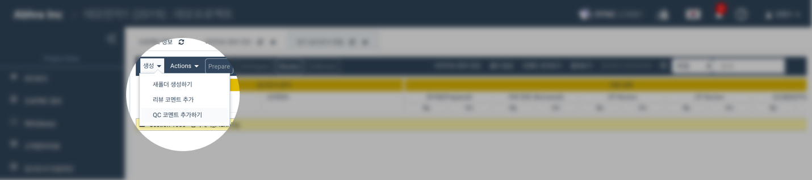

### 4-2. QC comment 를 다운로드 할 수 있습니다.

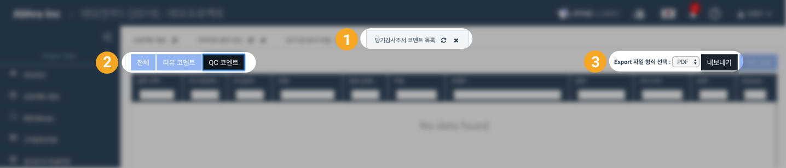

### 4-3. QC Status Report 를 다운로드 할 수 있습니다.

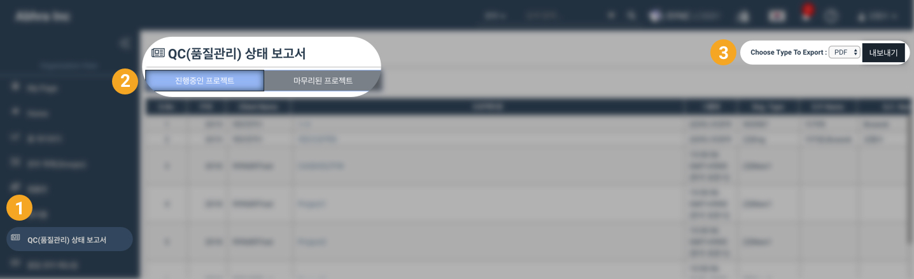

### 4-4. Home Dashboard 를 다운로드 할 수 있습니다.

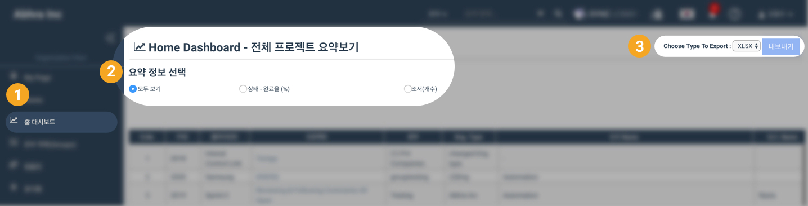

## 5. 감사조서 관련 업데이트

1. ​열려있는 모든 감사조서를 강제종료\(Force Close\) 할 수 있습니다. 
2. 파일 업로드 용량 제한이 30MB로 상향 조정되었습니다.

   > * 기존 용량 제한 10MB
   > * 다중 파일 업로드 기능 사용시 한 번에 10개 파일을 올릴 수 있으며, 따라서  총 파일 업로드 용량은 1회당 300MB로 제한됩니다. \(30MB \* 10 = 300MB\)

3. 최대 30MB 까지 zip 파일을 '다중 파일 업로드' 또는 '끌어다 놓기\(Drag and Drop\)' 방식으로 업로드 할 수 있습니다.
4. 단축키를 사용해 감사조서를 사인오프 하거나 감사조서 상태\(녹색 / 주황색 / 붉은색\)를 변경할 수 있습니다.

### 5-1. 열려있는 모든 감사조서를 강제종료\(Force Close\) 할 수 있습니다.

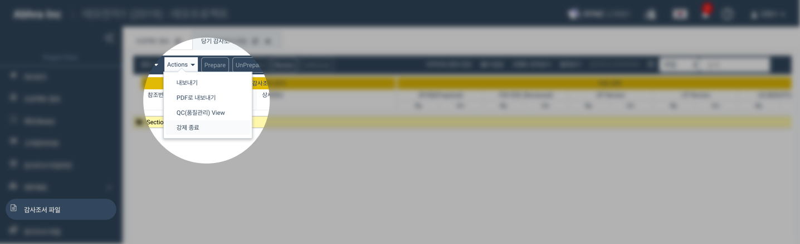

### 5-2. 파일 업로드 용량 제한이 30MB로 상향 조정되었습니다.

당기감사조서, 영구조서, 템플릿 메뉴 모두 파일 업로드 용량 제한이 30MB로 상향되었습니다.

### 5-3. 최대 30MB 까지 zip 파일을 '다중 파일 업로드' 또는 '끌어다 놓기\(Drag and Drop\)' 방식으로 업로드 할 수 있습니다.

### 5-4. 단축키를 사용해 감사조서를 사인오프 하거나 감사조서 상태\( 초록색 / 붉은색 \)를 완료로 변경할 수 있습니다.

1. 감사조서를 선택하고 키보드의 **P** 키를 누르면 감사조서가 프리페어\(Prepare\) 사인오프 됩니다. 
2. 감사조서를 선택하고 키보드의 **R** 키를 누르면 감사조서가 리뷰\(Review\) 사인오프 됩니다.  
3. 감사조서를 선택하고 키보드의 **S** 키를 누르면 감사조서의 스테이지\(Stage\) 상태가 완료\(Completed\)로 변경됩니다.  
4. 감사조서를 선택하고 키보드의 **F** 키를 누르면 감사조서의 파이널\(Final\) 상태가 완료\(Completed\)로 변경됩니다.  

> 주의사항
>
> 1. 한/영 전환 키를 눌러 '영문'으로 설정된 상태에서 단축키를 사용하여 주십시오. 
> 2. 사인오프 취소는 단축키로 진행할 수 없습니다.
>
> 여러개의 감사조서를 한꺼번에 사인오프 하는 다중 사인오프 기능은 5월 업데이트에 반영됩니다.

