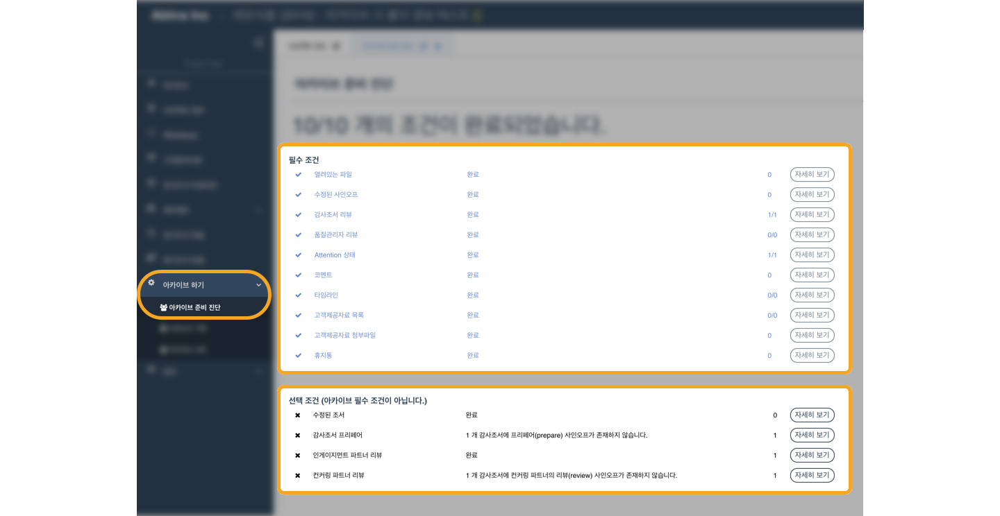
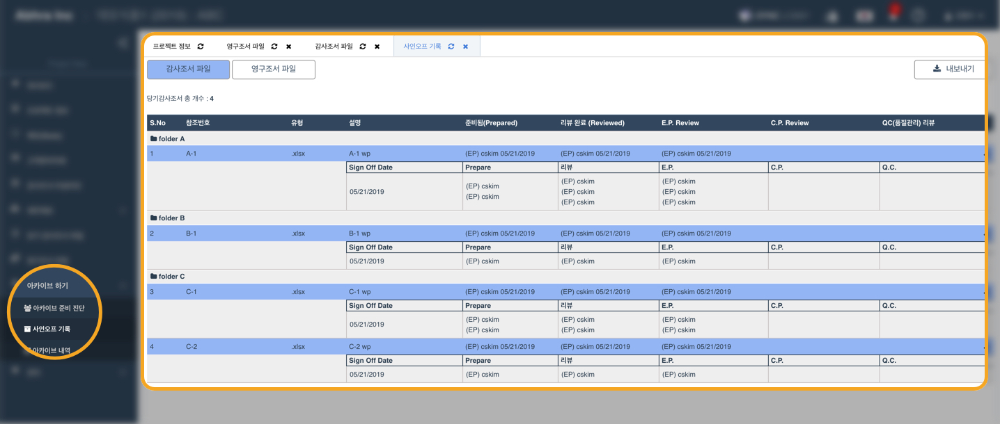
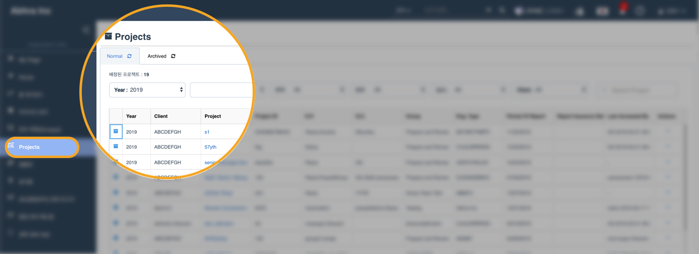
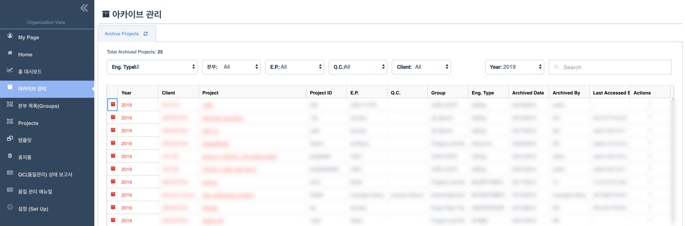
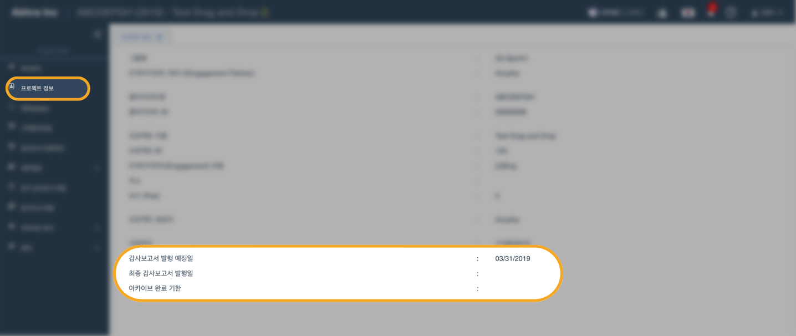

# 2019년 5월 업데이트 안내

## 주요 업데이트 요약보기

### **1. 아카이브 \(조서취합완료\) 관련 변경사항** 

1. **붉은색 \* 표시가 있어도 아카이브를 진행할 수 있습니다.** 
2. **아카이브 준비진단 화면이 개선되었습니다.**
   * 아카이브 준비 진단 화면에서 확인 가능한 항목 확대
     * 사인오프 이후 내용이 수정된 조서
     * 사인오프 이후 다른 팀원의 사인오프가 수정된 조서
   * 아카이브 준비 항목이 필수 조건과 선택 조건으로 나뉘어 표시됩니다.
3. **아카이브를 위해 본인의 이메일 주소를 입력해야 합니다.** 
4. **아카이브 시 관련 내용을 담은 압축 파일이 생성됩니다.**
5. **아카이브된 프로젝트의 이용이 제한됩니다.** 
   * 아카이브 이후 기존 팀원들이 프로젝트에 접근할 수 없습니다. 
   * 법인 전체에서 Super Admin으로 설정된 사용자만 아카이브된 프로젝트를 열거나, 특정 사용자의 접근을 허용할 수 있습니다. 
   * Super Admin이 아카이브된 프로젝트에 접근할 수 있도록 허용한 사용자가 Archive 권한이 있고 Project Admin 인 경우, 다른 사용자를 활성화 하거나 아카이브를 해제할 수 있습니다.  

### **2. 새로운 메뉴가 추가되었습니다.** ‌ 

1. **사인오프 기록** \(Sign Off History\): \(위치: 프로젝트 메뉴 &gt; 아카이브 &gt; 사인오프 기록\) 프로젝트 전체 사인오프 기록을 하나의 화면에서 확인할 수 있습니다. 
2. **프로젝트 목록** \(Projects\): \(위치: 법인 메뉴 &gt; 프로젝트\) 자신이 배정된 프로젝트 목록을 일반 프로젝트와 아카이브된 프로젝트로 나누어 확인할 수 있습니다. 
3. **아카이브 관리** \(Archive Management\): \(위치: 법인 메뉴 &gt; 아카이브 관리\) 법인 아카이브 관리자를 위한 화면입니다. \(관리자에게만 보여집니다.\) 아카이브 관리 화면을 통해 아카이브된 프로젝트의 목록을 확인하고 일반 사용자의 접근 권한을 설정할 수 있습니다. 

## 업데이트 상세 안내

### **1. 아카이브 조건 및 아카이브 준비진단 화면 업데이트** 

#### **1-1. 붉은색 \* 표시가 있어도 아카이브를 진행할 수 있습니다.**

붉은색 \* 표시는 감사조서가 사인오프 이후 수정된 상황을 나타냅니다. 붉은색 \* 표시가 있어도 아카이브를 진행할 수 있습니다.

#### **1-2. 아카이브 준비진단 화면이 개선되었습니다.**

* 아카이브 준비 진단 화면에서 확인 가능한 항목 확대
  * 사인오프 이후 내용이 수정된 조서
  * 사인오프 이후 다른 팀원의 사인오프가 수정된 조서
* 아카이브 준비 항목이 필수 조건과 선택 조건으로 나뉘어 표시됩니다.


'열려있는 파일' 항목의 '자세히 보기' 기능은 6월 업데이트에 적용될 예정입니다.


### 2. 아카이브 진행 과정 업데이트

#### **2-1. 아카이브 진행 시 사용자의 이메일 주소를 확인합니다.**

#### **1-4. 아카이브 시 관련 내용을 담은 압축 파일이 생성됩니다.**

* 압축파일의 구성 
  * 프로젝트 정보 PDF
  * 프로젝트 참여자 목록 PDF
  * 아카이브 기록 \(아카이브 일자 및 담당자 정보\) PDF
  * 사인오프 기록 최종본 및 상세정보 PDF 
  * 당기감사조서 \(폴더 구조 유지\)
  * 영구조서 \(폴더 구조 유지\)

아카이브 버튼을 누르고 이메일을 입력하면 아카이브 성공 메시지와 함께 아카이브 압축 파일 생성이 시작됩니다. 압축 파일 생성이 완료되면 압축파일은 AWS 원격 저장소로 옮겨지며, 아카이브 진행자의 이메일로 다운로드 링크\(24시간 이후 만료\)가 전송됩니다.


다운로드 되는 파일은 원격저장소에 보관된 압축파일의 복사본입니다.



24시간이 지나 링크가 만료되면 별도로 법인의 관리자에게 별도로 권한을 요청해야 압축파일을 다운로드 할 수 있습니다.



압축파일의 다운로드 및 개별적인 보관은 필수사항이 아닙니다. 단, 아카이브 진행자가 법인 전체의 최고관리자가 아닌 경우 아카이브된 프로젝트에 접근이 차단되므로, 참고자료로 보관하실 수 있습니다.


#### **1-5. 아카이브된 프로젝트의 이용이 제한됩니다.**

* 아카이브 이후 기존 팀원들이 프로젝트에 접근할 수 없습니다. 
* 법인 전체에서 Super Admin으로 설정된 사용자만 아카이브된 프로젝트를 열거나, 특정 사용자의 접근을 허용할 수 있습니다. 
* Super Admin이 아카이브된 프로젝트에 접근할 수 있도록 허용한 사용자가 Archive 권한이 있고 Project Admin 인 경우, 다른 사용자를 활성화 하거나 아카이브를 해제할 수 있습니다. 


아카이브가 완료된 이후 해당 프로젝트에 접근하기 위해서는 법인 아카이브 관리자 \(Super Admin or Archive Manager\) 에게 접근권한을 요청해야 합니다.


#### 1-6. 온라인 사용자가이드 관련 페이지

### **3. 새로운 메뉴** ‌ 

#### **3-1.  사인오프 기록** \(Sign Off History\)

* 위치: 프로젝트 메뉴 &gt; 아카이브 &gt; 사인오프 기록
* 프로젝트의 전체 사인오프 기록을 하나의 화면에서 확인할 수 있습니다. 

#### **3-2. 프로젝트 목록** \(Projects\)

* 위치: 법인 메뉴 &gt; 프로젝트
* 자신이 배정된 프로젝트 목록을 일반 프로젝트\(진행중인 프로젝트\) 와 아카이브 된 프로젝트로 나누어 확인할 수 있습니다. 
* 올해\(2019년\)가 기본으로 설정되어 있습니다. 프로젝트가 나타나지 않는 경우 연도를 변경하여 확인하실 수 있습니다. 
* 아카이브 된 프로젝트는 아카이브 탭에서 확인하실 수 있습니다. 
* 아카이브 된 프로젝트 중 관리자의 허가를 받지 않은 프로젝트는 열 수 없습니다. 

#### **3-3. 아카이브 관리** \(Archive Management\)

* 위치: 법인 메뉴 &gt; 아카이브 관리
* 법인 아카이브 관리자를 위한 화면입니다. \(관리자에게만 보여집니다.\) 
* 아카이브 된 프로젝트의 전체 목록을 확인하고 일반 사용자의 접근 권한을 설정할 수 있습니다. 
* 올해\(2019년\)이 기본으로 설정되어 있습니다. 특정 프로젝트를 찾지 못할 경우 연도 설정을 확인하여 주십시오. 
* 법인 전체의 아카이브 관리자인 경우에도 스스로를 해당 프로젝트에 등록하지 않으면 압축파일을 다운로드 하거나 프로젝트의 아카이브를 해제할 수 없습니다. 

### 4. 기타

#### 4-1. 프로젝트를 보다 간편하게 삭제할 수 있습니다.

* 프로젝트 내부의 파일을 삭제하지 않아도  프로젝트를 삭제할 수 있습니다. 
* 법인 관리자\(Super Admin\)인 경우 다음 화면에서 프로젝트를 삭제할 수 있습니다. 
  * 프로젝트\(Projects\), 아카이브 관리\(Archive Management\): 이메일 입력이 필요합니다. 
  * 본부 \(Groups\) 
* 프로젝트 관리자인 경우\(Project Admin\) 다음 화면에서 프로젝트를 삭제할 수 있습니다.

  * 본부 \(Groups\): 삭제할 프로젝트를 선택하면 화면 우측 상단에 삭제 버튼이 나타납니다. 

  > 프로젝트 화면에서 프로젝트를 삭제하는 기능이 다음 업데이트에 추가될 예정입니다.

#### 4-2. 프로젝트 정보에 항목이 추가되었습니다.

* 감사보고서 발행 예정일\(Expected Issuance Date\) 
* 최종 감사보고서 발행일\(Final Issuance Date\)
* 아카이브 완료 기한\(Expected Archive Date\)

위 항목을 프로젝트 정보에 입력할 수 있습니다.

* 위 항목은 프로젝트 생성 시 또는 생성 후 추가하거나 수정할 수 있습니다. 
* 작성되지 않은 경우 압축파일 등의 보고서에 표시되지 않습니다.  
* 최종 감사보고서 발행일이 품질관리용 대시보드\(QC status report\) 화면에 표시됩니다. 

