# 2019년 8월 업데이트

## 8월 업데이트 문제해결 진행상황

#### **1. 배정된 프로젝트\(Assigned project\) 화면 --&gt; 해결 완료**


14일 수요일 배포 과정에 발생한 오류를 바로잡아 해결되었습니다.


1. 문제가 발생한 부분

   몇몇 회계법인에서 법인용 메뉴 &gt; 마이페이지 &gt; 배정된 프로젝트 화면이 동작하지 않습니다.

2. 해당 부분을 대체할 수 있는 방법

   법인용 메뉴 &gt; 프로젝트 화면에서 소속 그룹이나 프로젝트 EP의 이름을 사용하여 프로젝트 목록을 필터링 하여 배정된 프로젝트를 찾을 수 있습니다.

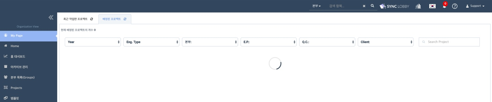

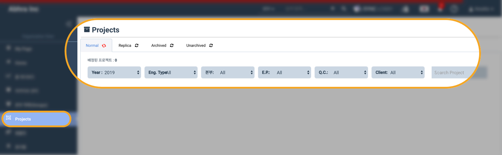

#### 2. 우클릭을 통한 개별 파일 다운로드 --&gt; 19일 월요일 재배포를 통해 해결될 예정입니다


한글 인코딩 때문에 발생한 문제로, 제목이 한글로 된 파일에서만 발생하는 것을 확인하였습니다. 19일 월요일 재배포를 통해 문제가 해결될 예정입니다.


1. 문제가 발생한 부분

   지난주 업데이트에서 당기감사조서와 영구조서 개별 파일을 우클릭으로 다운로드 하는 기능이 추가되었으나, 몇몇 회계법인에서 해당 기능을 사용할 경우 오류 메시지가 나타나고 있습니다.

2. 해당 부분을 대체할 수 있는 방법

   파일 자체의 문제가 아니라 경로 설정에서 비롯된 문제이므로, 파일을 더블 클릭하여 여시면 기존 방식대로 다운로드 하실 수 있습니다.

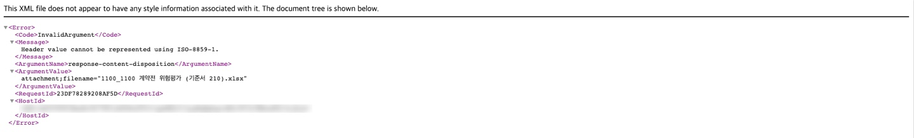

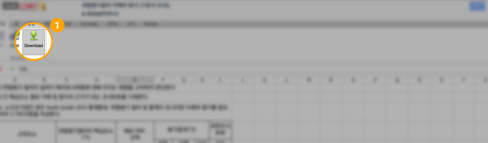



반기 업무로 바쁘신 중에 이러한 안내를 드리게 되어 매우 죄송합니다. 8월15일을 목표로 문제를 해결하기 위해 노력하고 있습니다. 이용에 불편함을 드린 것에 대해 다시 한번 사과드리며, 이번 경험을 바탕으로 더욱 나은 시스템을 구축하겠습니다.

## 8월 업데이트 항목

1. 당기감사조서 / 영구조서 개별 파일 다운로드 
2. 템플릿 수정 권한 제한 및 템플릿 복제 기능 추가  
3. 템플릿, 당기감사조서, 영구조서 정렬 기능 
4. 롤 포워드 시 기존 팀원 추가 가능  
5. 아카이브 조건 설정 기능   
6. 사인오프 히스토리 화면 업데이트 
7. 기타  

## 🌱 8월 업데이트 요약보기

#### 1. 당기감사조서 / 영구조서 개별 파일 다운로드

> 당기 감사조서 및 영구조서 화면에서 조서를 열지 않고도 우클릭을 통해 다운받을 수 있습니다.

#### 2. 템플릿 수정 권한 제한 및 템플릿 복제 기능 추가

> * 최고 관리자만 템플릿을 생성/수정/삭제할 수 있습니다. 
> * 그룹 관리자의 템플릿 생성 및 수정이 제한됩니다. 
> * 템플릿을 복제하여 새로운 템플릿을 만들 수 있습니다.

#### 3. 템플릿, 당기감사조서, 영구조서 정렬 기능

> 템플릿, 당기감사조서, 영구조서 화면에서 파일을 정렬할 수 있습니다.

#### 4. 롤 포워드 시 기존 팀원 추가 가능

> 롤 포워드로 프로젝트를 생성할 경우 기존 팀원 추가 여부를 선택할 수 있습니다.

#### 5. 아카이브 조건 설정 기능

> 법인의 아카이브 관리자가 계약유형\(인게이지먼트 타입, Engagement Type\)에 따라 아카이브 조건을 설정할 수 있습니다.
>
> 이에 따라 기존 아카이브 진단 화면\(Archive Diagnosis\) 항목 구성이 변경되었습니다.

#### 6. 사인오프 히스토리 화면 업데이트

> * 사인오프 취소 기록 역시 사인오프 히스토리에 나타납니다. 
> * 초 단위 시간이 기록됩니다.

#### 7. 기타

> * 프로젝트에 팀원을 추가할 경우 이름과 이메일 주소를 사용하여 사용자를 검색할 수 있습니다. 
> * 아카이브 관리 화면에서 프로젝트를 열지 않고 상세 정보를 확인할 수 있습니다.

## 🌱 8월 업데이트 상세보기

## 1. 당기감사조서 / 영구조서 개별 파일 다운로드

당기 감사조서 및 영구조서 화면에서 조서를 열지 않아도 우클릭을 통해 감사조서 파일을 다운받을 수 있습니다.

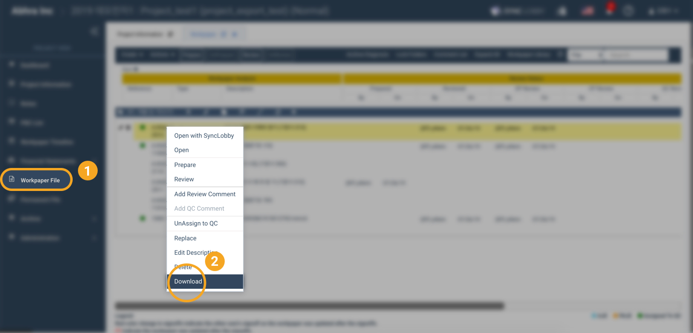

> * 비어있는 PDF 파일을 다운로드 할 경우 경고문이 나타납니다.   
> * Flux Analytics, Final Analytics 메뉴에는 아직 적용되지 않은 기능입니다.

## 2. 템플릿 수정 권한 제한 및 템플릿 복제 기능 추가

* 최고 관리자만 템플릿을 생성/수정/삭제할 수 있습니다. 
* 그룹 관리자의 템플릿 생성 및 수정이 제한됩니다. 
* 템플릿을 복제하여 새로운 템플릿을 만들 수 있습니다.

### 2-1. 템플릿 메뉴 화면의 구성 안내

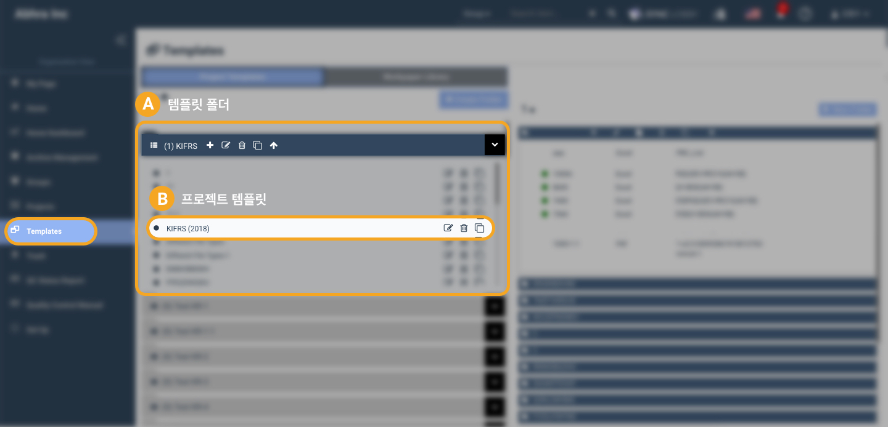

> * 'A - 템플릿 폴더'는 프로젝트에 사용되는 템플릿들을 모아둔 폴더를 말합니다. 
> * 'B - 프로젝트 템플릿'은 프로젝트에 사용되는 개별 템플릿을 말합니다. 템플릿 안에는 해당 템플릿의 폴더와 파일들이 들어있습니다.

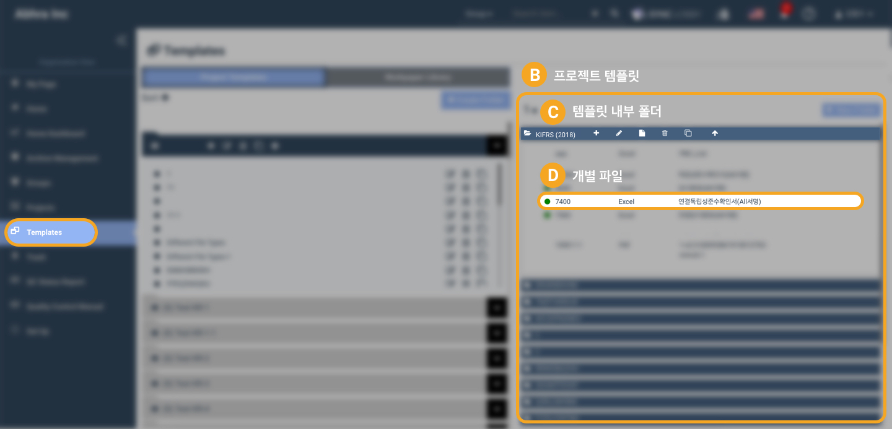

> * 'B - 프로젝트 템플릿'은 좌측에서 선택한 프로젝트 템플릿입니다. 
> * 'C - 템플릿 내부 폴더'는 프로젝트 템플릿 내부의 폴더입니다. 
> * 'D - 개별 파일'은 프로젝트 템플릿 안의 개별 파일입니다. \(개별 당기감사조서 파일을 말합니다.\)

### 2-2. 템플릿 메뉴 화면의 복사 기능 안내

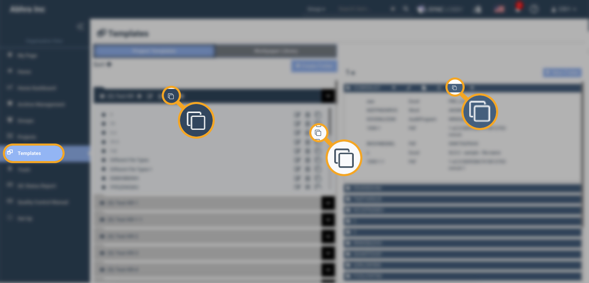

법인용 화면 &gt; 템플릿 메뉴에서 위 버튼을 이용하여 템플릿 폴더 또는 템플릿을 복제하실 수 있습니다.


템플릿 폴더, 프로젝트 템플릿, 템플릿 내부 폴더는 데이터 양에 따라 복제에 걸리는 시간이 다릅니다. 데이터가 클 경우 많은 시간이 필요합니다. 버튼을 여러번 누르지 마시고 기다려주십시오.


템플릿 폴더, 프로젝트 템플릿, 템플릿 내부 폴더의 경우 복제가 완료되면 이메일로 완료 알림이 전송됩니다. 완료 알림 이메일을 받은 후 화면을 새로고침하면 결과를 확인하실 수 있습니다.

개별 파일의 경우 이메일 알림 없이 곧바로 복제가 진행됩니다. 결과가 나타나지 않을 경우 화면을 새로고침 하여 주십시오.

## 3. 템플릿, 당기감사조서, 영구조서 정렬 기능

템플릿, 당기감사조서, 영구조서 화면에서 파일을 정렬할 수 있습니다.

### 3-1. 템플릿 정렬

### 3-2. 당기감사조서 정렬


또는 드래그 앤 드랍\(Drag and Drop\)으로 파일의 순서를 조정할 수 있습니다.


### 3-3. 영구조서 정렬

위 화면과 동일한 아이콘을 사용하여 파일을 정렬할 수 있습니다.

## 4. 롤 포워드 시 기존 팀원 추가 가능

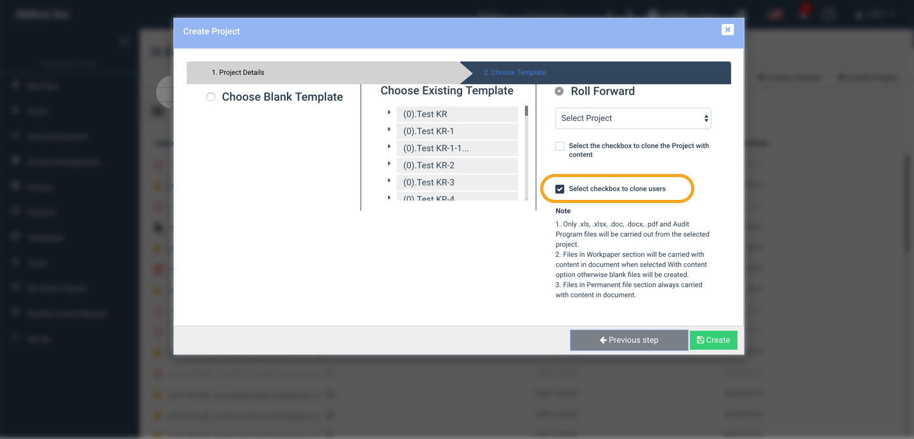

롤 포워드로 프로젝트를 생성할 경우 기존 팀원의 추가 여부를 선택할 수 있습니다.

1. 프로젝트 생성시 가장 오른쪽의 'Roll Forward'  항목에 체크합니다.  
2. 롤 포워드 할 프로젝트를 선택합니다. 
3. 프로젝트 내부의 기존 폴더와 파일 복제 여부를 선택합니다. 
4. 프로젝트에 배정된 기존 팀원의 복제 여부를 선택합니다. 


롤 포워드로 복제된 프로젝트에 팀원들은 모두 비활성화 상태로 추가됩니다. 롤포워드 진행자는 프로젝트 진행을 위해 팀원을 활성화해야 합니다.


## 5. 아카이브 조건 설정 기능

법인의 아카이브 관리자\(Archive Manager\)가 계약유형\(인게이지먼트 타입, Engagement Type\)에 따라 아카이브 조건을 설정할 수 있습니다.

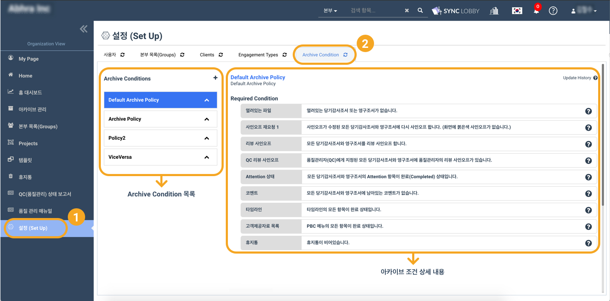

1. 아카이브 관리자는 아카이브 조건을 설정할 수 있습니다. 
2. 아카이브 관리자는 계약유형\(Engagement Type\)에 적용할 아카이브 조건을 선택할 수 있습니다. 
3. 아카이브 관리자만 아카이브 조건을 만들고, 편집하고, 복사하고, 삭제하고, 이동할 수 있습니다. 
4. 아카이브 관리 권한이 없는 최고 관리자\(Super Admin\)와 그룹 관리자\(Group Admin\)는 아카이브 조건을 열람할 수 있지만 편집하거나 삭제할 수 없습니다. 

### 5-1. 새로운 아카이브 조건 만들기

* 버튼을 눌러 새로운 아카이브 조건을 추가할 수 있습니다. 

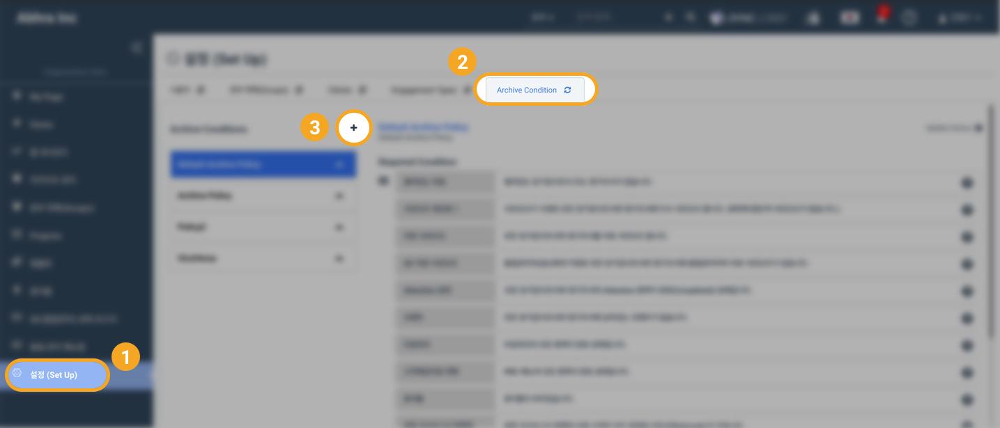

### 5-2. 아카이브 조건에 계약유형\(Engagement Type\) 지정하기

1. 업데이트 이후 처음으로 아카이브 조건 화면에 들어갈 경우, 기존의 모든 계약유형이 'Default Archive Policy' 에 들어있습니다. 
2. 5-1을 참고하여 새로운 아카이브 조건을 만듭니다. 
3. 드래그 앤 드랍\(Drag and Drop\)으로 계약 유형을 새로운 아카이브 조건으로 옮길 수 있습니다. 
4. 화면에 이동 확인 요청이 나타나면 '확인'을 클릭합니다. 


이동된 계약 유형은 아카이브 진행시 새로운 아카이브 조건의 영향을 받습니다.


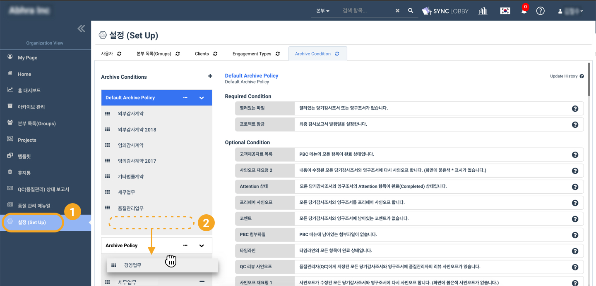

### 5-3. 아카이브 조건 별 상세항목 설정

드래그 앤 드랍\(Drag and Drop\)으로 아카이브 조건 별 상세항목의 필수조건/선택조건 여부를 설정할 수 있습니다.


편집 이후 반드시 화면 하단의 '저장' 버튼을 눌러주십시오.



필수조건\(Required Condition\)으로 설정된 항목들을 완료해야만 해당 조건이 적용된 프로젝트를 아카이브 할 수 있습니다.


### 5-4. 아카이브 조건 수정이 이미 아카이브 된 프로젝트에 미치는 영향

1. 아카이브 조건 수정은 이미 아카이브 된 프로젝트에는 영향을 미치지 않습니다. 
2. 아카이브 된 프로젝트를 아카이브 해제 하는 경우 수정된 아카이브 조건이 아닌 기존 아카이브 조건\(아카이브 당시의 아카이브 조건\) 의 영향을 받습니다. 
3. 아카이브 사본\(Replica\)은 아카이브 조건이 수정될 경우 수정된 아카이브 조건의 영향을 받습니다.  

### 5-5. 아카이브 조건 설정 기능 추가에 따른 기존 아카이브 사전 진단 화면\(Archive  Diagnosis\)의 변화

1. 사인오프 재요청 1, 사인오프 재요청 2, 최종 감사보고서 발행일, 프로젝트 잠금, 수정사유\(Rationale\) 항목이 추가되었습니다. 
   * 사인오프 재요청 1: 사인오프 수정에 따라 다시 사인오프가 필요한 경우를 말합니다. \(화면에 붉은색 사인오프가 없어야 함을 의미합니다.\) 
   * 사인오프 재요청 2: 조서 파일 내용의 수정에 따라 다시 사인오프가 필요한 경우를 말합니다. \(화면에 붉은색 \*이 없어야 함을 의미합니다.\) 
   * 최종 감사보고서 발행일: 프로젝트 정보 화면에서 최종 감사보고서 발행일을 설정했는지의 여부를 말합니다. 최종 감사보고서 발행일을 설정해야 수정사유\(Rationale\)를 작성할 수 있습니다. 
   * 프로젝트 잠금: 프로젝트 잠금 여부를 말합니다. 
   * 수정사유\(Rationale\): 최종 감사보고서 발행일을 설정하면 이후 수정된 내용에 대하여 수정사유를 작성할 수 있습니다.  수정사유 작성 대상\(최종 감사보고서 발행일 이후 수정된 조서\) 중 수정사유가 작성되지 않은 파일의 개수가 표시됩니다. 
2. 적용되는 아카이브 조건의 명칭이 화면에 표시됩니다. 


주의: Default Archive Condition \(업데이트 이후 기본적으로 모든 계약유형이 지정되는 기본 아카이브 조건\) 에 '최종 감사보고서 발행일' 항목이 '필수조건'으로 추가되었습니다.

기본 아카이브 조건을 그대로 사용하실 경우, 아카이브를 위해 프로젝트 정보 화면에서 최종 감사보고서 발행일 항목을 설정하여 주십시오.


## 6. 사인오프 히스토리 화면 업데이트

* 사인오프 취소 기록이 사인오프 히스토리에 나타납니다. 사인오프 앞에 '--' 표시가 있는 경우 사인오프를 취소한 기록입니다. 
* 초단위까지 시간이 기록됩니다. 

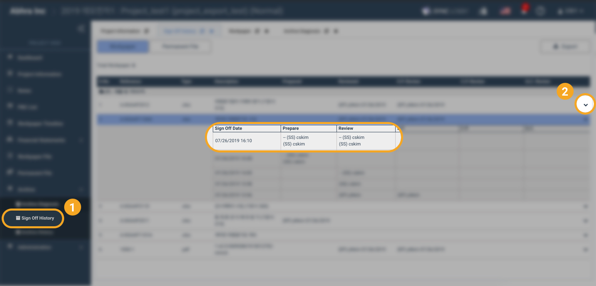

## 7. 기타

### 7-1. 프로젝트에 팀원을 추가할 경우 이름과 이메일 주소를 사용하여 사용자를 검색할 수 있습니다.

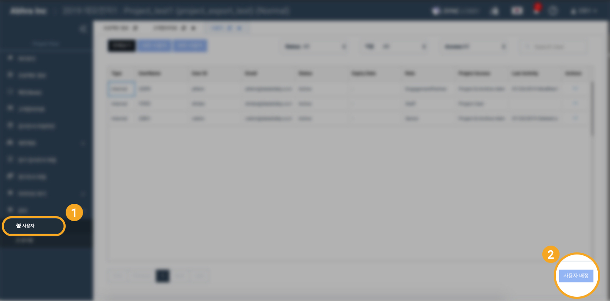

### 7-2. 아카이브 관리 화면에서 프로젝트를 열지 않고 상세 정보를 확인할 수 있습니다.

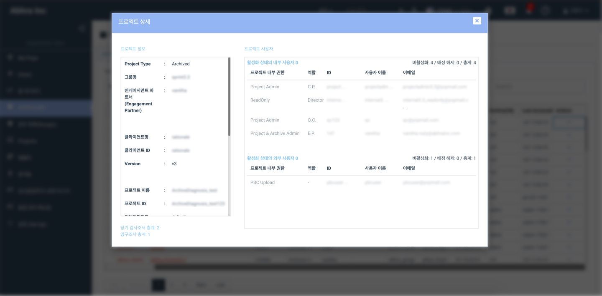


기존 방법 \(Access Management\)을 통해서도 프로젝트를 열람할 수 있습니다.


