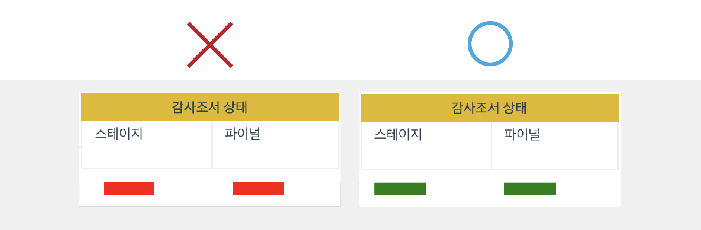
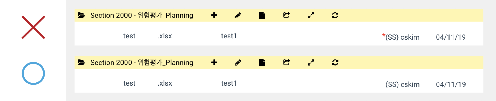
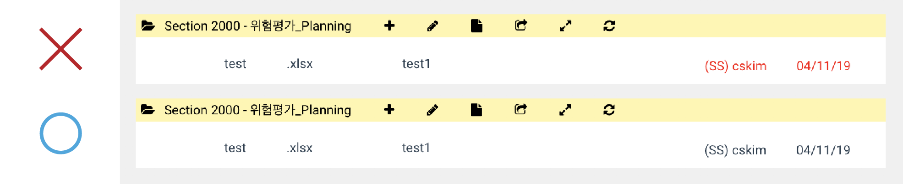
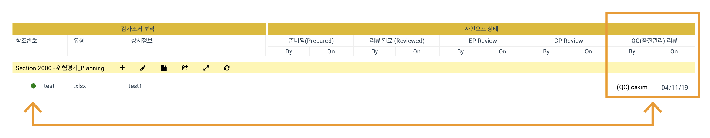
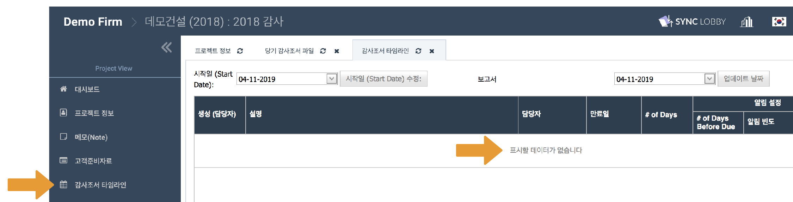
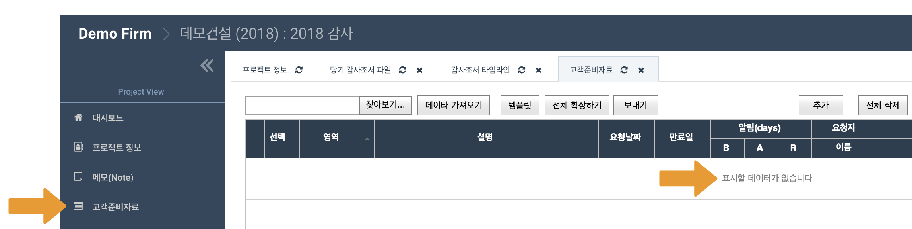
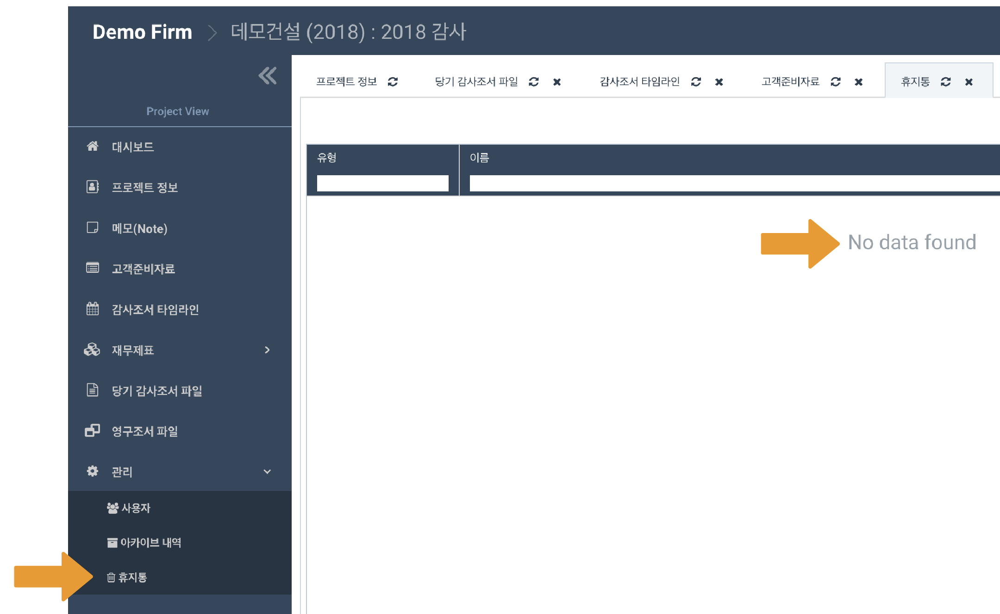
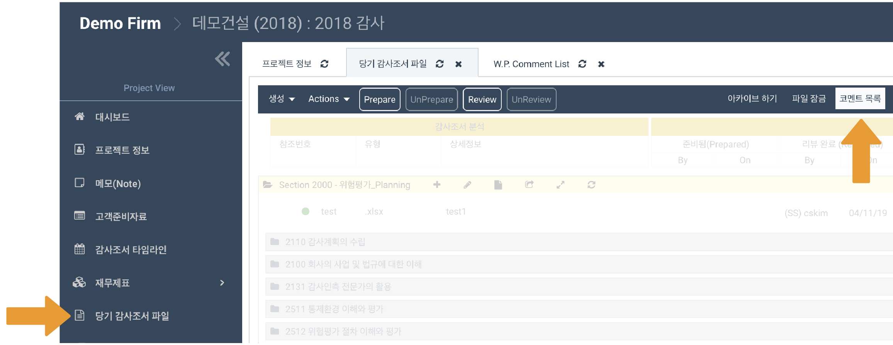
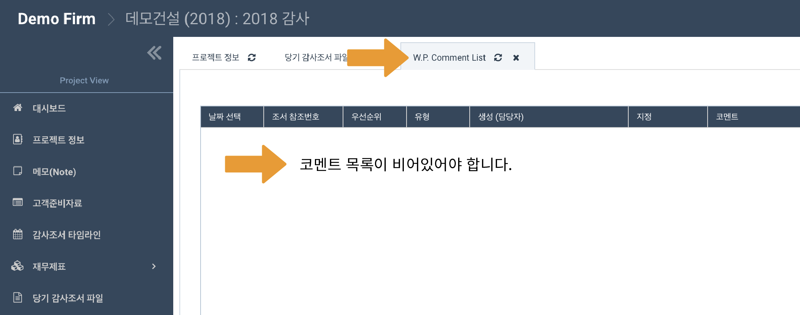

# 2019년 4월 업데이트 이후 아카이브 조건 안내

## 어딧로비에서 감사 프로젝트를 아카이브\(Close out\) 하는 방법

1. 모든 감사조서의 **최종 상태\(Final Status\)가 반드시 '완료 \(Completed\) - 초록색'**으로 _\*\*_변경되어야 합니다.
2. 모든 감사조서의 사인오프에는 **붉은색 \* 표시가 없어야** 합니다.

   > 사인오프에 표시되는 붉은색 \*는 해당 조서가 사인오프 이후 수정되었음을 나타냅니다. 표시를 없애기 위해 re-prepare 또는 re-review 를 눌러주십시오.

3. 모든 감사조서의 **사인오프는 붉은색이 아니어야** 합니다.

   > 사인오프가 붉은색인 경우, 다른 사용자가 해당 조서의 사인오프를 수정하여 재 승인이 필요한 상황을 의미합니다. 사인오프를 검은색으로 변경하기 위해 re-review 를 눌러주십시오.

4. 모든 감사조서에는 **리뷰 사인오프**가 있어야 합니다.

   > 프리페어 사인오프는 필수조건이 아닙니다.

5. 품질관리자\(QC\)에게 배정된 감사조서는 반드시 품질관리자의 리뷰 사인오프가 필요합니다.
6. 모든 **타임라인** 항목이 **삭제**되어야 합니다. 
7. 모든 **고객제공자료\(PBC\) 목록** 및 **첨부파일**이 **삭제**되어야 합니다. 
8. **휴지통**의 모든 파일이 **삭제**되어야 합니다. 
9. 모든 감사조서의 **코멘트**가 **삭제**되어야 합니다. 
10. 프로젝트 내의 **모든 조서가 닫혀있어야** 합니다. 

## 주의사항


이하 내용의 '감사조서'는 당기감사조서와 영구조서를 모두 포함합니다.



프로젝트 아카이브 권한이 없는 사용자에게는 아카이브 버튼이 보이지 않습니다. 이 권한은 프로젝트 관리자\(project admin\)인 사용자의 경우 설정할 수 있습니다.


## 요약보기

## 아카이브 조건 상세보기


'감사조서'로 기재된 항목에 관하여 당기감사조서와 영구보관조서를 모두 확인하여 주십시오.



이하 10 개 항목을 모두 완료하였고 '아카이브 준비 진단' 메뉴에 붉은색 항목이 없는데도 아카이브가 진행되지 않는 경우 고객지원팀으로 연락주십시오.


### 1. 모든 감사조서의 최종 상태\(Final Status\)가 반드시 '완료\(Completed\)' \(초록색\) 상태로 변경되어야 합니다.

> 감사조서를 선택한 후 키보드의 F 키를 눌러 파이널 상태를 '완료\(초록색\)'로 변경할 수 있습니다.

### 3. 모든 감사조서의 **사인오프는 붉은색이 아니어야** 합니다.

### 2. 모든 감사조서의 사인오프에는 **붉은색 \* 표시가 없어야** 합니다.

> 감사조서의 사인오프에 붉은색 \* 표시가 있으면 해당 감사조서가 해당 사인오프 이후 수정되었음을 나타냅니다.

### 4. 모든 감사조서에는 리뷰 사인오프가 있어야 합니다.

> 감사조서의 사인오프가 붉은색인 것은 다른 사용자의 사인오프가 변경되었음을 나타냅니다.

### 5. 품질관리자\(QC\)에게 배정된 감사조서는 반드시 품질관리자의 리뷰 사인오프가 필요합니다.

### 6. 모든 **타임라인** 항목이 삭제되어야 합니다.

> 모든 감사조서는 아카이브를 위해 반드시 리뷰\(review\) 사인오프 되어야 합니다.

> ### 7. 모든 **고객제공자료\(PBC\) 목록 및 첨부파일**이 **삭제**되어야 합니다.
>
> 품질관리자에게 배정된 감사조서\(파일 좌측에 초록색 동그라미로 표시됩니다.\)는 반드시 품질관리자의 리뷰 사인오프가 필요합니다.

### 8. 휴지통의 모든 파일이 삭제되어야 합니다.

### 9. 모든 감사조서의 **코멘트**가 **삭제**되어야 합니다.

### 10. 모든 조서가 닫혀있어야 합니다.

프로젝트 내의 모든 조서가 닫혀있어야 합니다.

* 10-1. 당기감사조서 메뉴의 Actions 버튼을 눌러 '강제종료' 기능을 사용하실 수 있습니다. 
* 10-2. 영구조서 메뉴의 Actions 버튼을 눌러 '강제종료' 기능을 사용하실 수 있습니다. 

> 프로젝트 내 열려있는 조서 목록을 확인하고 개별적으로 종료할 수 있는 기능은 5월 업데이트에 예정되어 있습니다.

