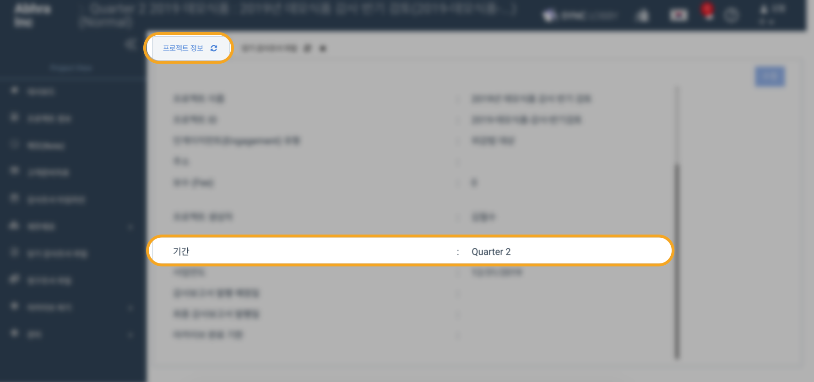
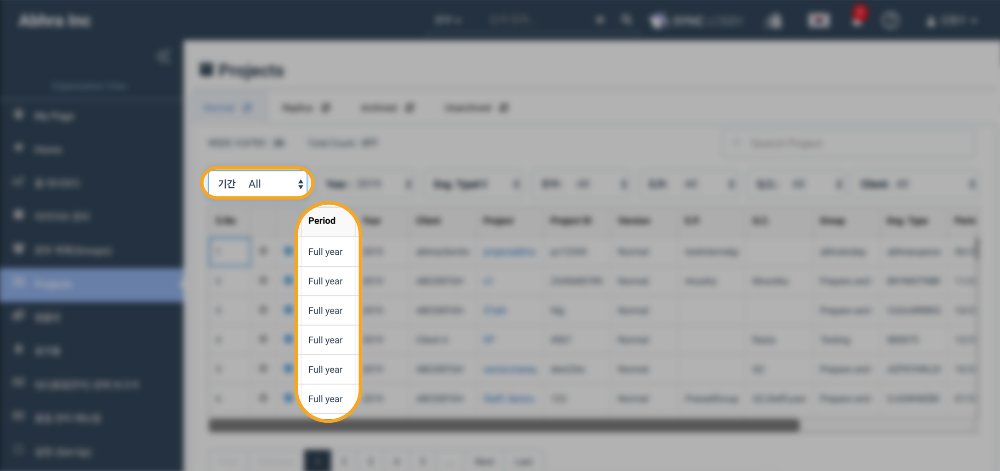
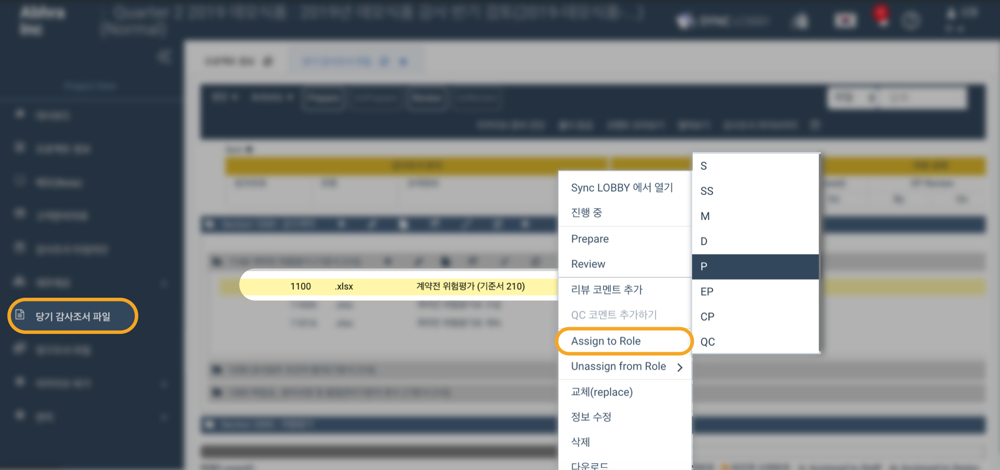
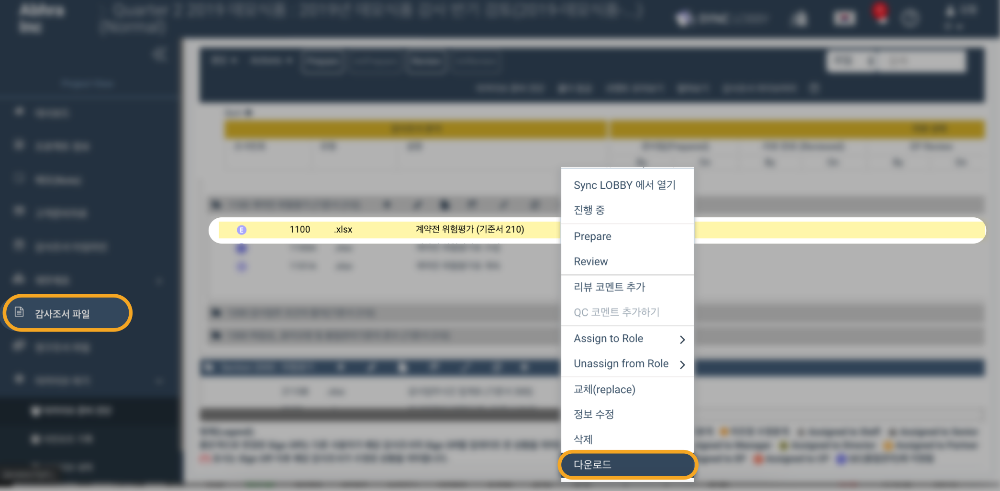

# 10월 업데이트

## 10월 업데이트 항목

* 프로젝트 기간\(period\) 정보 추가 
* 조서 담당 역할\(Assign To Role\) 기능 추가 

## **1. 기간\(Period\) 정보 추가**

* 프로젝트 정보 화면에 기간\(Period\) 정보가 추가되었습니다.
  * 연간 \(Full year\) / 반기\(Half year\) / 분기\(Quarter\) / 월별 \(Month\) 단위로 기간을 선택할 수 있습니다.
  * 기간 정보가 화면 상단 프로젝트 이름에 함께 표시됩니다.  

> 기존에 제공된 결산일 정보와 더불어 별도의 기간 정보를 통해 프로젝트의 목적을 보다 명확하게 할 수 있다는 많은 사용자의 요청이 있었습니다. 기간 정보 입력을 통해 감사 프로젝트의 분/반기 검토 또는 연말 감사 해당 여부를 명확하게 구분할 수 있습니다.

* 프로젝트\(Projects\), 아카이브 관리\(Archive Management\), 마이페이지 - 배정된 프로젝트 \(My page - Assigned project\), 품질 관리 상태 보고서\(QC status report\) 페이지에 기간\(Period\) 항목이 추가되었습니다.
* 프로젝트, 아카이브 관리 페이지에서 기간\(Period\) 필터를 사용할 수 있습니다. 
* 업데이트 이전에 만들어진 기존 프로젝트의 기간은 모두 Full year 로 설정됩니다.
* 이미 아카이브 된 프로젝트는 아카이브된 프로젝트의 기간을 변경할 수 없습니다.

  > 아카이브 관리자 또는 프로젝트 관리자인 경우에도 변경할 수 없습니다.

* 설정된 기간은 프로젝트가 아카이브 될 경우 아카이브 압축 파일의 '프로젝트 정보' PDF 파일에 표시됩니다.
* 이번 업데이트 이전에 아카이브된 프로젝트는 '프로젝트 정보' PDF 파일에 기간 정보가 표시되지 않습니다.

## **2. 역할 지정\(Assign Role\) 기능 추가**

1. 우측 메뉴의 Assign to Role\(역할 지정\) 기능을 사용하여 프로젝트의 모든 역할에 당기 감사 조서 파일을 지정 할 수 있습니다.
2. 역할 지정 기능은 법인용 메뉴의 '프로젝트 템플릿' 과 프로젝트 메뉴의 '당기감사조서 파일' 화면 및 '영구조서' 화면에서 사용할 수 있습니다.
3. 우측 메뉴의 'Unassign from Role' 을 선택하여 파일에 지정된 역할을 해제 할 수 있습니다.
4. 하나의 파일에 여러 역할을 지정 할 수 있지만 한 번에 하나씩만 지정 할 수 있습니다. 
5. '영구조서 파일' 화면에서는 감사조서에 QC 역할을 지정 할 수 없습니다.
6. 프로젝트 메뉴의 '아카이브 진단' 변경 사항 :
   * '담당 역할이 지정된 파일' 기준이 추가되었습니다.
   * 담당 역할이 지정된 파일 개수는 '담당 역할이 지정된 파일'에 표시됩니다.
   * 지정된 담당 역할의 리뷰가 완료되지 않은 경우 "자세히 보기"버튼을 사용하여 담당 역할의 리뷰가 필요한 파일을 볼 수 있습니다.
   * 지정된 모든 역할의 사용자가 리뷰를 완료하면 아카이브 준비 진단 상태가 완료로 변경되고 '자세히 보기' 링크가 비활성화됩니다.
7. 법인용 메뉴의 '설정 - 아카이브 조건' 변경 사항 :
   * '담당 역할이 지정 된 파일'이 아카이브 정책의 아카이브 조건 중 하나로 표시됩니다.
   * 법인의 아카이브 관리자가 아카이브 시 필수 또는 선택 조건으로 지정할 수 있습니다.

## **기타 업데이트**

### **1. 한글 제목 파일을 마우스 우클릭으로 내려받기**

* 한글로 제목이 입력된 당기감사조서/영구조서 파일을 마우스 우클릭을 통해 내려받을 수 있습니다. 

