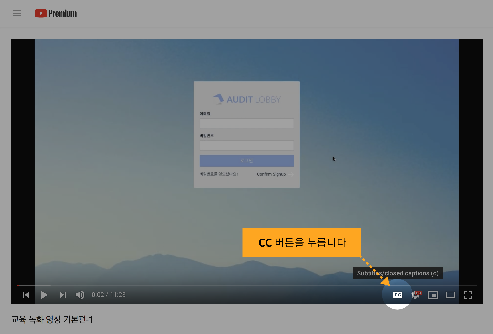
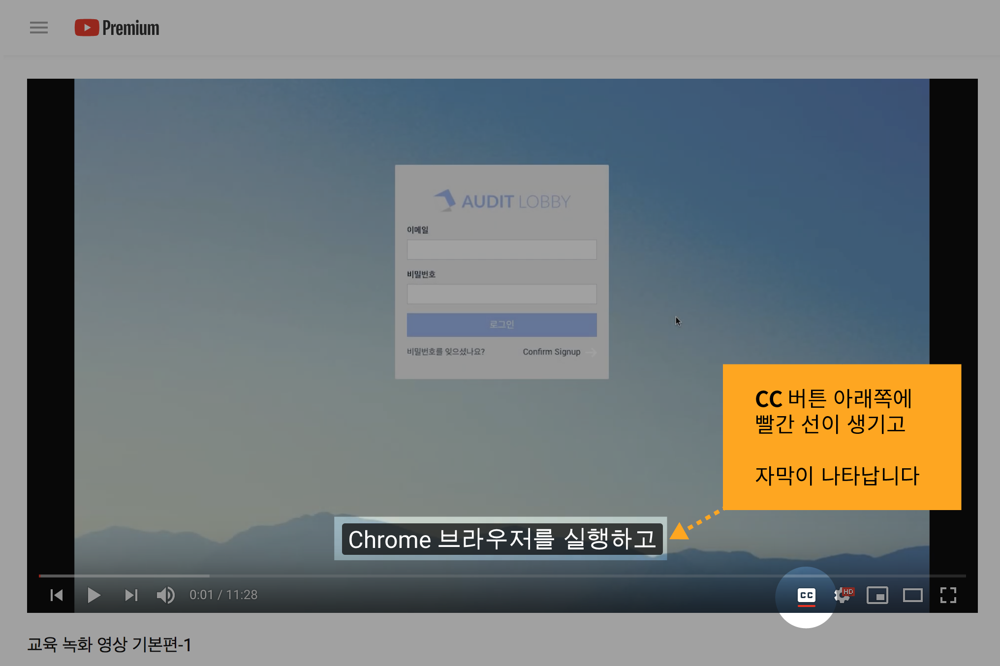

# \(Draft\)Audit LOBBY Guide \(Youtube\)\(Razia - Question: Please put English version videos\)

Please press the CC button to turn on the subtitles.

> * Adjust the resolution accordingly.

### Basic edition

[Basic Training Recorded Video-1\(Creating a Project in Korean Public Relations Form\)](https://www.youtube.com/watch?v=rj175wKqI7s&index=1&list=PLK017PlkCF9e9V-5ta0rticxFxZCLxk0U)

[Basic Training Recorded Video-2 \(Creating a Project from a Blank Template\)](https://www.youtube.com/watch?v=vTVNvX5VPr0&list=PLK017PlkCF9e9V-5ta0rticxFxZCLxk0U&index=2)

